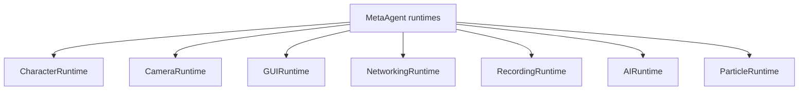
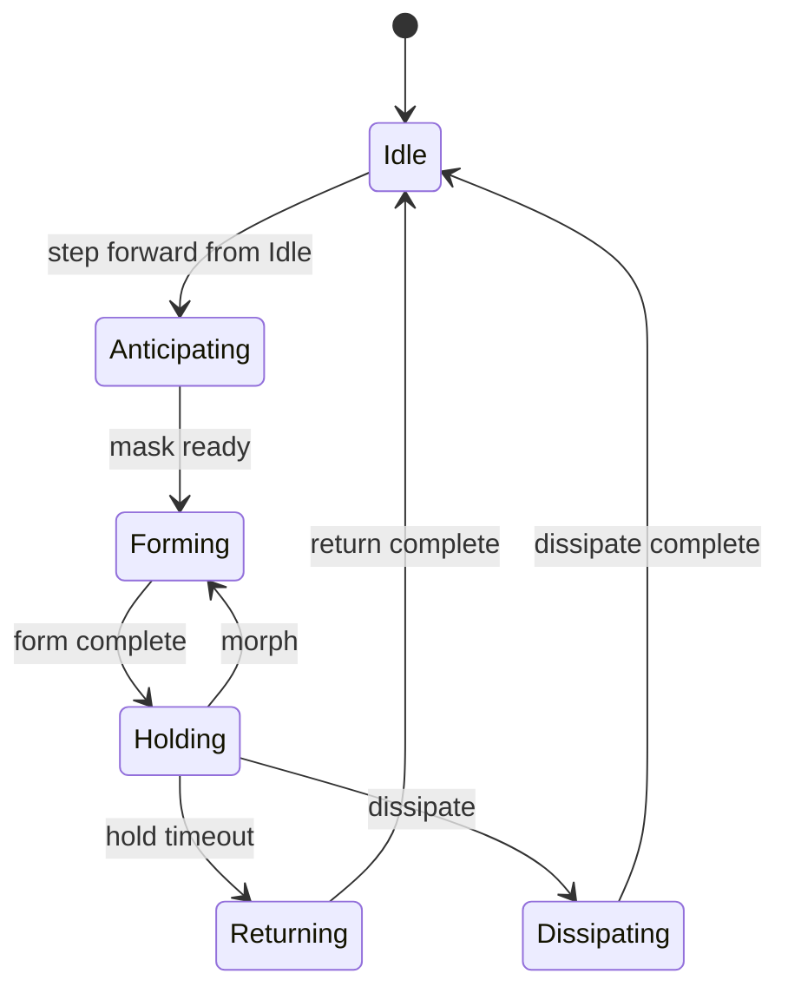
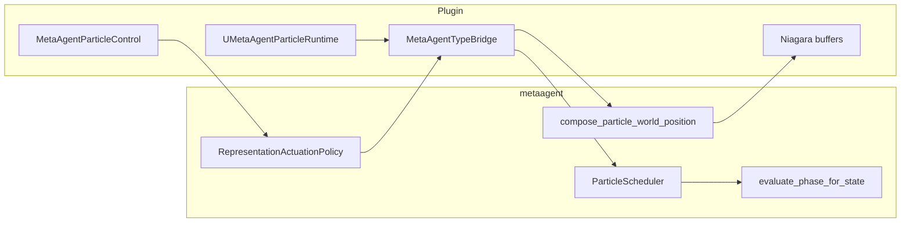

# MetaAgentPlugin

Under heavy development.

UE5 plugin for a multimodal MetaAgent runtime (character, camera, GUI, networking, recording, AI wander, particle orchestration). Modules: **MetaAgentPlugin** (runtime), **MetaAgentPluginEditor** (editor).

Portable domain logic lives in [`metaagent/`](./metaagent/) and is embedded into the plugin. See [`metaagent/README.md`](./metaagent/README.md) and [`metaagent/ARCHITECTURE.md`](./metaagent/ARCHITECTURE.md) for the core/host split.

---

## What is in `metaagent` vs the UE plugin?

| Concern | Portable (`metaagent/`) | UE host only |
|---------|-------------------------|--------------|
| Particle FSM, actuation, solvers | Yes | Niagara I/O, orchestrator, assets |
| Camera orbit / zoom / sway math | Yes | View target blend, focus queries, observation lock |
| Inbound HTTP `/health` `/echo` `/notify` | Yes (handlers) | Epic HTTPServer bind (`Host/MetaAgentHttpBridge`) |
| Outbound platform HTTP (H/G COMMS) | **No** (yet) | `UMetaAgentGameInstance::SendEventToPlatform` |
| Command + GUI validation | Yes | Key binds, HUD panel, dispatch |
| Input policy (GUI open vs observation) | Yes | Enhanced Input, `PlayerTick` mouse hit-test |
| AI autopilot, recording, character pawn | No | `MetaAgentGameplay`, `MetaAgentPlayerController` |

**Not everything is in core yet.** Particles and camera **math** are; viewport/rendering, outbound HTTP, AI, and recording remain host responsibilities.

---

## Runtime overview



Default play mode today: **particle observation** — cinematic camera focused on particles, movement/mouse look disabled until you open the controls panel (**Q**). Mouse wheel zooms orbit distance when the panel is closed.

---

## Source layout

Runtime sources under `Source/MetaAgentPlugin/`:

| Path | Role |
|------|------|
| `MetaAgentPlugin.h/.cpp` | Module startup, settings, Blueprint library, outbound HTTP helper |
| `MetaAgentGameplay.h/.cpp` | Game mode, character, AI, game instance, HUD draw, camera sequences, **outbound COMMS** |
| `MetaAgentHUD.h` | HUD / GUI panel types |
| `MetaAgentPlayerController.h/.cpp` | Input, camera host state, GUI dispatch, recording, particles |
| `MetaAgentParticle*.h/.cpp` | Orchestrator, runtime, shapes, types |
| `MetaAgentTypeBridge.h/.cpp` | UE ↔ core conversion, scheduler + camera sync |
| `MetaAgentCoreAggregate.cpp` | Embeds `metaagent/metaagent.cpp` |
| `Host/MetaAgentHttpBridge.*` | Inbound HTTP server bridge |
| `Host/MetaAgentHostSession.*` | Session snapshot for core validation |
| `Host/MetaAgentInputBridge.*` | Command / GUI validation wrapper |

Editor: `Source/MetaAgentPluginEditor/`.

---

## Module 1 — CharacterRuntime

- Default pawn spawn/possess via `AMetaAgentGameMode`
- Character input is **off** in default observation mode (enable via modular runtime START or future panel section)
- **Implemented in:** `MetaAgentGameplay.h/.cpp`, `MetaAgentPlayerController.cpp`

---

## Module 2 — CameraRuntime

Observation cinematic camera with particle focus.

| Layer | What |
|-------|------|
| **Core** | `metaagent::camera::CameraController`, `compute_cinematic_pose`, `apply_orbit_radius_zoom` |
| **UE** | `FMetaAgentCameraRuntime`, view-target blend, `TryLockParticleFocusTarget`, startup auto-focus |

### Controls

| Input | Action |
|-------|--------|
| **O** | Toggle cinematic mode |
| **P** | Re-focus on particles |
| **Wheel** | Zoom orbit radius (panel closed, cinematic on) |

### Config (UE)

Edit on `AMetaAgentPlayerController` → **Camera \| Cinematic** (`FMetaAgentCinematicCameraState`): pan duration, orbit radius, sway, oscillation amplitude, blend times, etc. Values sync to core `CinematicSettings` / `CinematicRuntimeState` each tick via `MetaAgentTypeBridge`.

Observation tuning: `ParticleObservationPaddingScale`, `ParticleObservationMinOrbitRadius` on the player controller.

### Adding camera styles / states

1. Add `CinematicStyle` + motion in `metaagent/include/metaagent/camera/rig.cpp`.
2. Add matching `EMetaAgentCinematicCameraStyle` and TypeBridge enum mapping.
3. Optionally wire a command in `metaagent/app/commands` and a GUI panel row.

Focus resolution (where to look) stays in UE: `FMetaAgentCameraRuntime::ResolveFocusTarget`.

---

## Module 3 — GUIRuntime

Press **Q** to toggle the controls panel. Click rows or use keyboard shortcuts.

**Panel sections (current):**

| Section | Actions |
|---------|---------|
| GUI | Q — toggle panel; Esc — quit |
| Camera | O — cinematic; P — particle focus (wheel zoom noted as status line) |
| Particle | F — load preview; `,` / `.` — step pattern; B / N — Slow / Dramatic presets |

Section headers support **START/STOP** toggles for Camera and Particle runtimes. Expand/collapse via the `>` / `v` control.

Dispatch: `FMetaAgentGUIRuntime::DispatchPanelAction` → validates via core (`MetaAgentInputBridge`) → `ExecuteGuiParticleAction` for particle rows (no double keyboard gate).

Keyboard shortcuts for morph, cycle modes, snappy/dreamy presets, recording, networking, and AI still exist where bound but are **not** shown as panel rows.

- **Implemented in:** `MetaAgentHUD.h`, `MetaAgentGameplay.cpp` (draw/hit-test), `MetaAgentPlayerController.cpp`

---

## Module 4 — NetworkingRuntime

Two separate paths:

| Path | Implementation |
|------|----------------|
| **Inbound** local HTTP server | Core handlers in `metaagent/net/`; bind via `FMetaAgentHttpBridge` when networking runtime START |
| **Outbound** platform events | UE `FHttpModule` POST from `UMetaAgentGameInstance` (**H** / **G** keys — not in current GUI panel) |

Settings: `UMetaAgentPluginSettings` (port, enable flags).

- **Implemented in:** `MetaAgentGameplay.h/.cpp`, `Host/MetaAgentHttpBridge.*`, `MetaAgentPlugin.h`

---

## Module 5 — RecordingRuntime

Viewport capture via Movie Scene Capture (**J** toggle, **U** finalize). Not exposed in the trimmed GUI panel.

- **Implemented in:** `MetaAgentPlayerController.cpp`

---

## Module 6 — AIRuntime

Autopilot toggle (**I**). Not exposed in the trimmed GUI panel.

- **Implemented in:** `MetaAgentGameplay.h/.cpp`, `MetaAgentPlayerController.cpp`

---

## Module 7 — Particle orchestrator + runtime

### Roles

- **`UMetaAgentParticleOrchestrator`** — capture, preview texture, pattern config, `TriggerEffect(FName)`
- **`UMetaAgentParticleRuntime`** — scheduler tick; builds representation frame and applies actuation
- **`AMetaAgentPlayerController`** — input host, Niagara export callbacks, GUI particle actions

FSM and actuation math run in core `ParticleScheduler` (no duplicate graph in the plugin).

### Controls

| Input | Action |
|-------|--------|
| **F** | Load `sdxl_latest.png` preview + shape source |
| **,** / **.** | Step pattern backward / forward |
| **B** / **N** | Slow / Dramatic preset |
| **J** / **K** | Snappy / Dreamy preset (keyboard only; J also bound to recording toggle) |
| **M**, **T**, **Y**, **U** | Morph, cycle sampling/forming/returning (keyboard only) |

GUI panel mirrors **F**, **,**, **.**, **B**, **N** only.

Console: `MetaAgent.Pattern.*` (Form, Hold, Return, Preset, Status, Shape, ScatterGrid, Cancel, …).

### Pattern state machine



### Portable vs UE (particles)



### Implemented in

- `MetaAgentParticleControl.h/.cpp` — orchestrator, drivers, Niagara profiles
- `MetaAgentParticleRuntime.h/.cpp` — runtime tick, buffer I/O
- `MetaAgentParticleShapes.h/.cpp` — PNG, mask cache, providers
- `MetaAgentTypeBridge.h/.cpp` — scheduler bridge
- `MetaAgentPlayerController.cpp` — input router, `ExecuteGuiParticleAction`

### Assets & Niagara

- Pattern data asset: `MetaAgentParticlePattern` (see `Config/DefaultGame.ini`)
- Niagara User params: `Content/MetaAgent/Niagara/PARAMETERS.md`

---

## Build

```powershell
# UE plugin (from repo root)
.\dev.bat build

# Portable core tests
cd metaagent
cmake -S . -B build -DCMAKE_BUILD_TYPE=Release
cmake --build build
ctest --test-dir build --output-on-failure
```

---

## License

Licensed under the [MIT License](./LICENSE).
