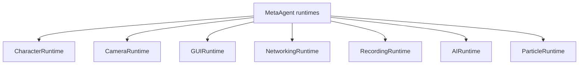
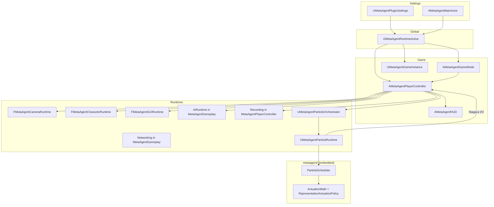
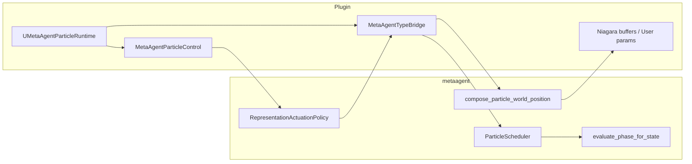
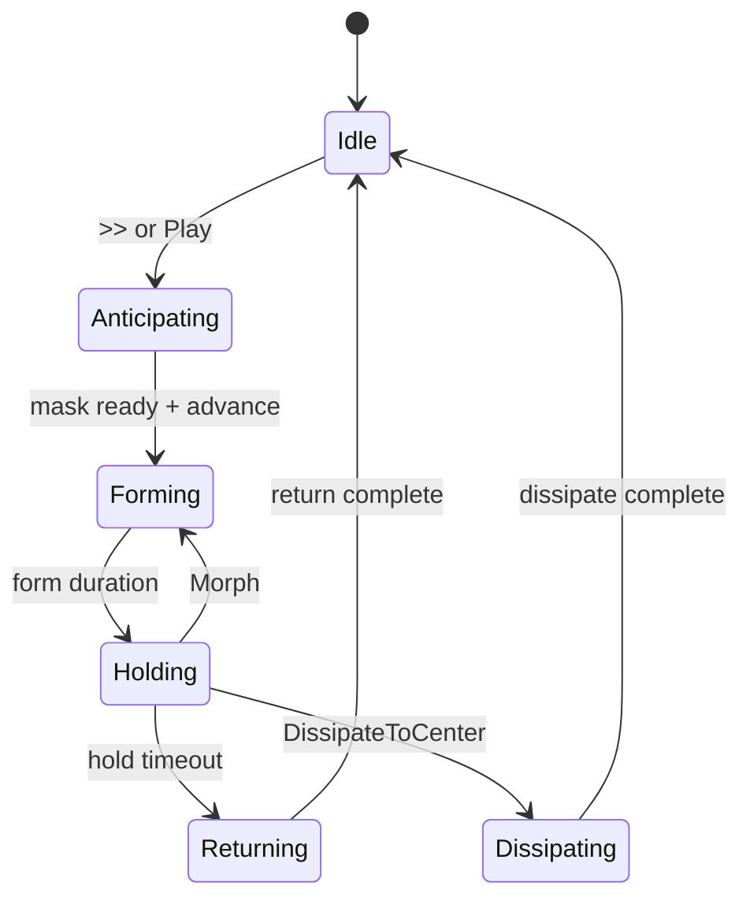
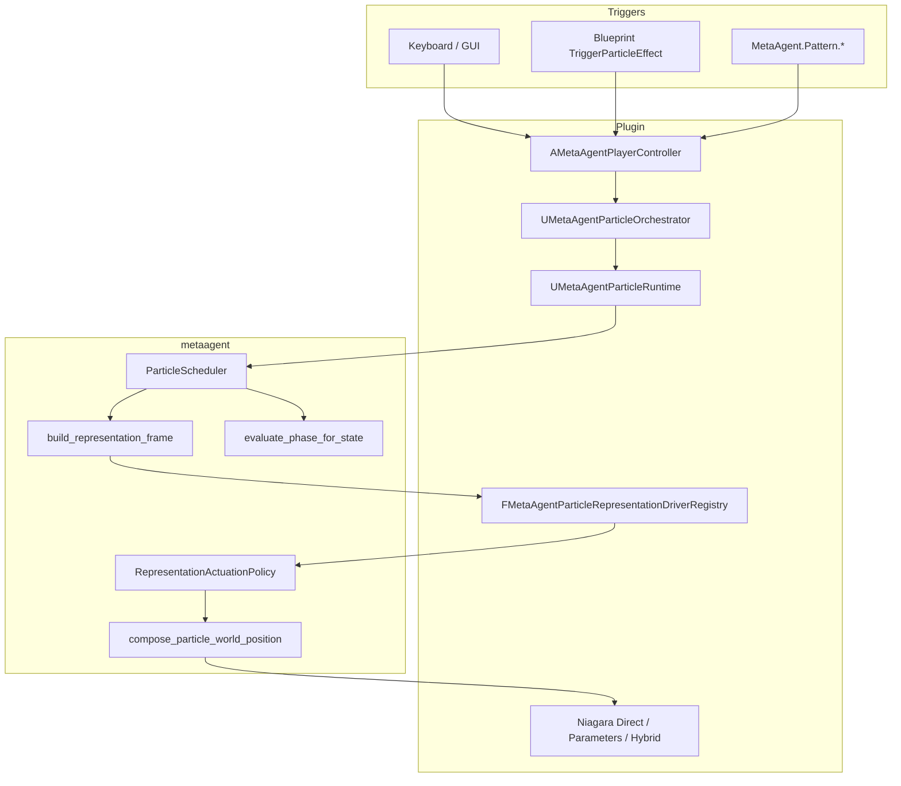
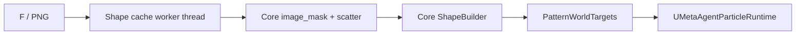

# MetaAgentPlugin

Under heavy development.

UE5 plugin for a multimodal MetaAgent runtime (character, camera, GUI, networking, recording, AI wander, particle orchestration). Modules: **MetaAgentPlugin** (runtime), **MetaAgentPluginEditor** (editor).

Objective: allow an active agent to control the cinematic area — default levels, BPs, and keyboard-driven runtimes for exploration and particle choreography.

Portable particle mechanics live in [`metaagent/`](./metaagent/) and are embedded into the plugin; see [`metaagent/README.md`](./metaagent/README.md) and [`metaagent/ARCHITECTURE.md`](./metaagent/ARCHITECTURE.md).

---

## Runtime overview

---

## Source layout (flat module)

All runtime sources sit under `Source/MetaAgentPlugin/` (no `Systems/` / `Public/` split):

| File | Role |
|------|------|
| `MetaAgentPlugin.h/.cpp` | Module startup, settings, Blueprint library, gameplay tags |
| `MetaAgentGameplay.h/.cpp` | Game mode, character, AI controller, BT tasks, game instance + HTTP networking |
| `MetaAgentHUD.h` | HUD / GUI panel types (`FMetaAgentGUIRuntime` lives here) |
| `MetaAgentPlayerController.h/.cpp` | Input owner: camera, GUI, recording, autopilot, particles UI |
| `MetaAgentParticleTypes.h` | Pattern USTRUCTs, actuation enums, orchestrator types |
| `MetaAgentParticleRuntime.h/.cpp` | Pattern runtime UObject, Niagara capture/actuation glue |
| `MetaAgentParticleControl.h/.cpp` | Orchestrator, effect specs, representation drivers, Niagara profiles |
| `MetaAgentParticleShapes.h/.cpp` | Shape providers, PNG cache, mask → core `ShapeBuilder` |
| `MetaAgentTypeBridge.h/.cpp` | UE ↔ `metaagent` conversion + `MetaAgentParticleCoreBridge` scheduler |
| `MetaAgentCoreAggregate.cpp` | `#include`s all `metaagent/src/**/*.cpp` into the module |
| `MetaAgentPlugin.Build.cs` | Module rules + `metaagent/include` |

Editor module: `Source/MetaAgentPluginEditor/`.

---

## Portable core (`metaagent/`)

The plugin **instances** portable logic; it should not duplicate particle math.

| Portable (core) | UE bridge / I/O |
|-----------------|-----------------|
| `ParticleScheduler` — FSM tick, transitions, representation frame | `MetaAgentParticleCoreBridge` in `MetaAgentTypeBridge.cpp` |
| `ActuationMath::evaluate_phase_for_state` — forming/return curves | Curves sampled in `SyncRuntimeToCore` from `ActiveFormCurve` / `ActiveReturnCurve` |
| `ActuationMath::compose_particle_world_position` — full blend path | `build_actuation_compose_input` → Niagara buffer write |
| `RepresentationActuationPolicy` — Direct / Parameters / Hybrid | `ApplyRepresentationFrame` in `MetaAgentParticleControl.cpp` |
| `FormingSolverRegistry`, `ShapeBuilder`, `image_mask` | TypeBridge + `MetaAgentParticleShapes.cpp` |

Standalone tests: `cmake` + `ctest` in `metaagent/` (includes `actuation_composer_test`).

---

## Module 1 — CharacterRuntime

- Default pawn spawn/possess via `AMetaAgentGameMode`
- Blueprint-owned camera/mesh/animation on `BP_MH_PlayerChar`
- Minimal bootstrap on possess (no recovery pipeline)
- **Implemented in:** `MetaAgentGameplay.h/.cpp`, `MetaAgentPlayerController.cpp`

---

## Module 2 — CameraRuntime

Environment viewer: free-look, mouse wheel zoom, cinematic orbital mode (`O`).

- **Implemented in:** `MetaAgentPlayerController.h/.cpp` (`FMetaAgentCameraRuntime`, zoom/cinematic state structs)

---

## Module 3 — GUIRuntime

Help panel toggle (`Q`), keyboard reference, recording/networking status lines when visible.

- **Implemented in:** `MetaAgentHUD.h`, `MetaAgentPlayerController.cpp` (`FMetaAgentGUIRuntime`, `FMetaAgentGUIState`)

---

## Module 4 — NetworkingRuntime

Embedded HTTP server on `UMetaAgentGameInstance`, platform event forwarding, bottom-left panel when GUI is open.

- **Implemented in:** `MetaAgentGameplay.h/.cpp`, `MetaAgentPlugin.h` (settings)

---

## Module 5 — RecordingRuntime

Viewport capture via Movie Scene Capture (`J` toggle, `U` finalize), AVI under `Saved/Renders/`.

- **Implemented in:** `MetaAgentPlayerController.cpp` (`FMetaAgentRecordingState`)

---

## Module 6 — AIRuntime

Autopilot toggle (`I`), `AMetaAgentWanderAIController` with runtime-built behavior tree (patrol / wait loop).

- **Implemented in:** `MetaAgentGameplay.h/.cpp`, `MetaAgentPlayerController.cpp`

---

## Module 7 — Particle orchestrator + runtime

### Roles

- **`UMetaAgentParticleOrchestrator`** — capture, preview texture, pattern config, `TriggerEffect(FName)`
- **`UMetaAgentParticleRuntime`** — representation scheduler; each tick builds `FMetaAgentParticleRepresentationFrame` and applies actuation
- **`AMetaAgentPlayerController`** — thin host: input, Niagara export callbacks, Blueprint API → orchestrator
- **Macro phases:** Prepare → Express → Sustain → Release (Anticipating / Forming / Holding / Returning | Dissipating)
- **FSM:** core `TransitionGraph` via `ParticleScheduler` (no duplicate graph in plugin)
- **Drivers:** Direct (buffer writes), Parameters (User params), Hybrid (direct + scalars; editor vs shipping policy in core)
- **Registries** (defaults in `MetaAgentPlugin.cpp`): shape providers, forming solvers, representation drivers

### Controls

Keyboard: `F` preview, `,` / `.` step state, `B`/`N` presets, `T` sampling, `Y` forming, `U` returning. GUI (`Q`): **Play**, **<<** / **>>**, forming/returning cycle, preview thumbnails.

Console: `MetaAgent.Pattern.*` (Form, Hold, Return, Preset, Status, Shape, Forming, Returning, ScatterGrid, Cancel, …).

### Pattern state machine

### Orchestrator → runtime → core

### Forming / returning solvers

| Mode | Behavior |
|------|----------|
| DirectLerp | Straight baseline → target by phase |
| ArcLift | Vertical arc mid-motion |
| SpiralIn | Spiral around `PatternCenter` |
| DissipateToCenter | Collapse toward center (return path) |

Config: `FMetaAgentParticlePatternConfig` (**Pattern \| Forming** / **Pattern \| Returning**). Solvers run in core `FormingSolverRegistry`; UE registry wraps the same modes.

### Image scatter

Stratified grid over mask weights (`DensityGridScale`, `TargetJitterNormalized`, `GrayscaleGamma`). Core: `image_mask` + `ShapeBuilder`. UE: PNG load/cache in `MetaAgentParticleShapes.cpp`.

### Shape pipeline

Providers (UE registry): ImageSilhouette, SplinePath, MeshSilhouette, SquareGrid fallback.

### Return blend

On **Returning**, phase 1→0 lerps frozen idle snapshot → hold positions; below `ReturnReleaseAuthorityThreshold`, actuation policy stops direct writes so Niagara sim resumes before **Idle**.

### Implemented in

- `MetaAgentParticleControl.h/.cpp` — orchestrator, drivers, actuation request, Niagara profiles
- `MetaAgentParticleRuntime.h/.cpp` — runtime state, tick, Niagara buffer I/O
- `MetaAgentParticleTypes.h` — pattern/orchestrator USTRUCTs
- `MetaAgentParticleShapes.h/.cpp` — shapes, mask cache, providers
- `MetaAgentTypeBridge.h/.cpp` — scheduler bridge, compose input, type conversion
- `MetaAgentPlayerController.cpp` — particle input router section
- `MetaAgentPlugin.cpp` — default registry registration

### Assets & Niagara

- Pattern data asset: `MetaAgentParticlePattern` (see `Config/DefaultGame.ini`). Editor: `MetaAgent.CreateSamplePatternAssets`.
- Packaged Niagara User params: `Content/MetaAgent/Niagara/PARAMETERS.md`.

---

## License

Licensed under the [MIT License](./LICENSE).
