# MetaAgentPlugin

Under heavy development. 

- UE5 plugin with several runtimes for a multimodal agent with Humanoid structure.
- Modules: MetaAgentPlugin (Runtime), MetaAgentPluginEditor (Editor).

Objective: Allow an active agent to control the cinematic area. This plugin creates new levels and has default BPs to use. 

## Flowchart

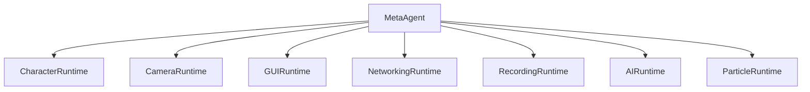

Architecture

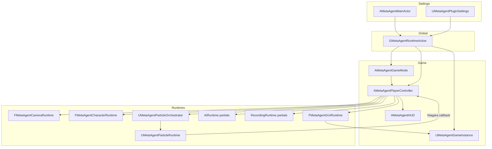

## Modules

### Module 1 : MetaAgentCharacterRuntime

CharacterRuntime Graph

- Default pawn spawn and possession via game mode
- Blueprint-owned camera/mesh/animation setup
- Minimal runtime bootstrap (no recovery pipeline)
- Implemented in:
	- `Systems/CharacterRuntime/MetaAgentCharacterRuntime.h`
	- `Systems/CharacterRuntime/MetaAgentCharacterRuntime.cpp`

#### Character runtime graph

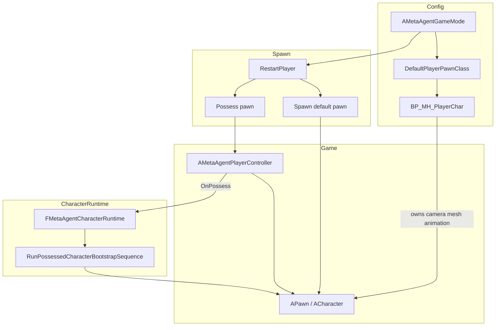

Module 1: simplified runtime flow

1. Resolve `DefaultPlayerPawnClass` from `MetaAgentGameMode` config.
2. Spawn and possess the default pawn through standard `AGameModeBase::RestartPlayer`.
3. Keep CharacterRuntime bootstrap minimal (no mesh/anim recovery pipeline).
4. Let `BP_MH_PlayerChar` own camera, mesh, and animation setup directly.

### Module 2: MetaAgentCameraRuntime (Environment Viewer)

CameraRuntime Graph

- Environment-only camera system for pure scene exploration
- Free-look with mouse and keyboard movement
- Mouse wheel zoom for distance control
- Cinematic orbital camera mode (`O`)
- Simplified for viewer-only without character dependencies
- Implemented in:
	- `Systems/CameraRuntime/MetaAgentCameraRuntime.h`
	- `Systems/CameraRuntime/MetaAgentCameraRuntime.cpp`

#### Camera runtime graph

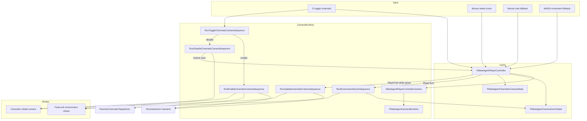

Module 2: Simplified runtime steps (environment viewing only)

1. Keep `AMetaAgentPlayerController` as the input owner for camera actions.
2. Route all camera execution through `FMetaAgentCameraRuntime` sequences.
3. Keep `FMetaAgentCameraZoomState` in the controller for zoom interpolation and bounds.
4. Consume discrete mouse-wheel up/down zoom input (step in/out).
5. Consume analog wheel-axis zoom input for smooth zooming.
6. Interpolate camera zoom distance toward desired distance.
7. Clamp zoom distances to configured min/max bounds (40–1500 units).
8. Clamp and sanitize zoom tuning values before runtime use.
9. Route `O` toggle handling through runtime cinematic-toggle sequence.
10. Enable cinematic mode through runtime camera-activation sequence (smooth orbital motion).
11. Disable cinematic mode through runtime camera-teardown sequence (restore free-look).
12. Update cinematic camera every frame through runtime update sequence.
13. Spawn a transient runtime `ACameraActor` when cinematic mode starts.
14. Reuse existing runtime cinematic camera actor when still valid.
15. Rebuild runtime cinematic camera actor when stale or world-mismatched.
16. Preserve pre-cinematic view state for deterministic restore on exit.
17. Restore view to free-look mode on cinematic exit.
18. Keep player input fully enabled during all camera modes (free exploration).
19. Apply oscillating-hold cinematic motion style (smooth sway around focus point).
20. Apply runtime sway and look-at behavior for cinematic framing.
21. Auto-disable cinematic mode when runtime camera prerequisites are lost.
22. Keep the runtime camera module extensible for additional orbital styles.

### Module 3: MetaAgentGUIRuntime

GUIRuntime Graph

- Runtime GUI panel orchestration owned by a dedicated module
- HUD help panel visibility toggle bound to keyboard (`Q`)
- Keyboard-function reference panel rendered when GUI help is active
- Implemented in:
	- `Systems/GUIRuntime/MetaAgentGUIRuntime.h`
	- `Systems/GUIRuntime/MetaAgentGUIRuntime.cpp`
	- `Systems/GUIRuntime/MetaAgentPlayerControllerGUI.cpp`

#### GUI runtime graph

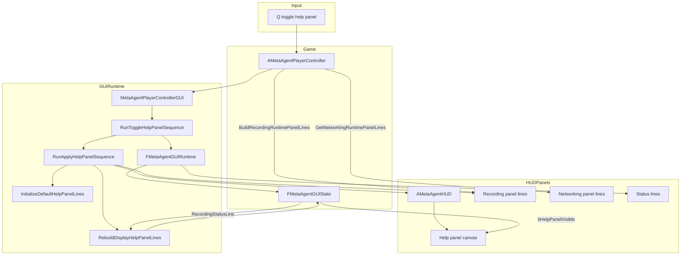

Module 3: 20 sequential runtime steps

1. Keep `AMetaAgentPlayerController` as input owner for GUI toggle actions.
2. Route GUI panel behavior through `FMetaAgentGUIRuntime` sequences.
3. Keep `FMetaAgentGUIState` in the controller as runtime GUI state storage.
4. Bind `Q` key in controller utility input setup for help panel toggling.
5. Handle `Q` key press through a dedicated controller-to-runtime bridge.
6. Initialize default keyboard-help lines on first GUI runtime application.
7. Keep help panel lines cached in runtime GUI state for deterministic redraw.
8. Apply GUI runtime state to HUD through explicit runtime apply sequence.
9. Push canonical help lines from GUI runtime to HUD each apply cycle.
10. Push help-panel visibility flag from GUI runtime to HUD each apply cycle.
11. Toggle help-panel visibility state in runtime sequence on each `Q` press.
12. Emit runtime log entries when help panel visibility changes.
13. Keep GUI toggle behavior free of transient keypress popup text.
14. Render help panel title and key-function rows via HUD canvas drawing.
15. Include active runtime key rows for recording (`J`/`U`) and COMMS (`H`/`G`).
16. Include fallback movement and look controls (`W/A/S/D`, `Shift`, mouse, wheel).
17. Keep help panel render path independent from status panel availability.
18. Keep recording status integrated into the main help panel with a separator row.
19. Preserve existing camera, autopilot, and recording runtime behavior unchanged.
20. Keep GUI runtime extensible for future panel types beyond controls help.

### Module 4: MetaAgentNetworkingRuntime

NetworkingRuntime Graph

- Runtime networking orchestration through `UMetaAgentGameInstance`
- Embedded HTTP server for editor, standalone, and packaged runtime builds
- Runtime outbound platform event forwarding and inbound notify handling
- Bottom-left Networking Runtime GUI panel shown when GUI (`Q`) is active
- Implemented in:
	- `Systems/NetworkingRuntime/MetaAgentGameInstanceNetworking.cpp`
	- `Systems/NetworkingRuntime/MetaAgentGameInstance.h`
	- `Systems/NetworkingRuntime/MetaAgentGameInstance.cpp`

#### Networking runtime graph

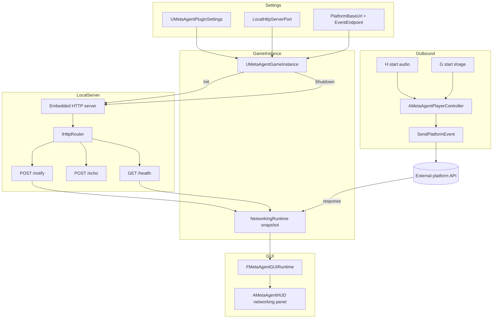

Module 4: 20 sequential runtime steps

1. Keep `UMetaAgentGameInstance` as the runtime networking owner.
2. Initialize NetworkingRuntime snapshot state during game instance startup.
3. Start local HTTP server during runtime init when networking is enabled.
4. Embed server behavior in editor, standalone, and packaged runtime builds.
5. Bind `/health` endpoint for runtime health checks.
6. Bind `/echo` endpoint for payload round-trip checks.
7. Bind `/notify` endpoint for external notifications.
8. Start listeners after routes are bound.
9. Track router/listener state in runtime snapshot fields.
10. Expose runtime server status through `GetLocalHttpServerStatusText`.
11. Build platform forwarding URL from configured base and endpoint.
12. Send outbound platform events with runtime metadata payload.
13. Track last event name, send time, receive time, and result status.
14. Track HTTP/network errors in runtime snapshot fields.
15. Parse platform response payload for agent action/running state.
16. Track latest notify message from `/notify` requests.
17. Stop server and unbind routes during game instance shutdown.
18. Expose formatted NetworkingRuntime panel lines to GUI runtime.
19. Draw bottom-left networking rectangle only while GUI panel is active.
20. Keep networking runtime extensible for future endpoint families.

### Module 5: MetaAgentRecordingRuntime

RecordingRuntime Graph

- Runtime recording based on Unreal Engine Movie Scene Capture (FrameGrabber, no HiResShot loop)
- `J` toggles viewport capture start/stop and writes an AVI video file directly to disk
- Video is captured from the active player viewport at a fixed FPS (default 30)
- Output directory is created under `Saved/Renders/Capture_YYYYMMDD_HHMMSS`
- `U` finalizes capture (if active) and reports output/status summary
- Recording panel shows runtime capture state, resolution, frame count, and output path
- Video compression can be toggled on the player controller (`bUseVideoCompression`, `VideoCompressionQuality`)
- Implemented in:
	- `Systems/RecordingRuntime/MetaAgentPlayerControllerRecording.cpp`

#### Recording runtime graph

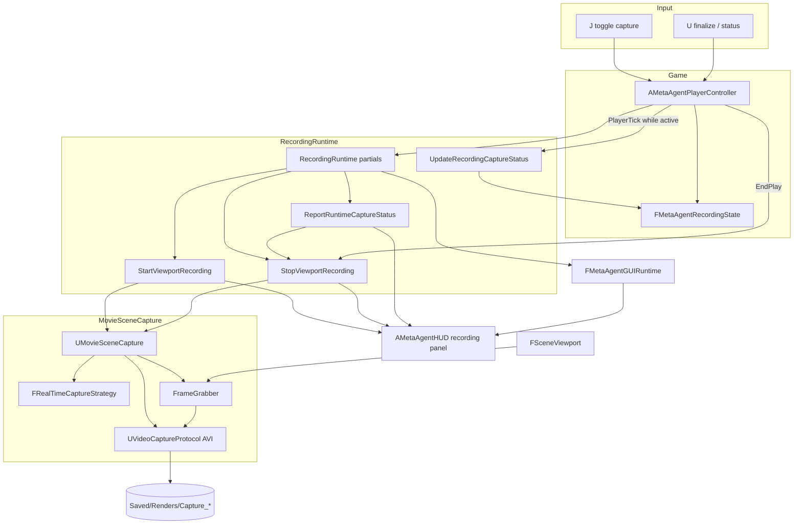

Module 5: 12 sequential runtime steps

1. Press `J` to start viewport video capture.
2. Initialize a new output folder in `Saved/Renders`.
3. Configure Movie Scene Capture with `UVideoCaptureProtocol` (AVI output).
4. Bind capture to the local game viewport and start recording.
5. Capture at configured fixed FPS (default 30 FPS).
6. Engine FrameGrabber streams frames into the AVI writer while gameplay continues.
7. Update recording runtime panel line values continuously.
8. Press `J` again to stop capture and finalize the AVI file.
9. Keep the captured video in the output directory.
10. Press `U` to finalize/status summary for the current or last capture session.
11. Use the output AVI directly or transcode externally if needed.
12. Capture resolution defaults to viewport size; optional override via recording settings.

### Module 6: MetaAgentAIRuntime

AIRuntime Graph

- Runtime AI wander controller (`AMetaAgentWanderAIController`) builds and runs a behavior tree in code.
- Autopilot toggle logic (`AMetaAgentPlayerController`) now lives in AIRuntime and hands possession to AI.
- Autopilot runtime toggle key is `I`.
- AI behavior is simple patrol wandering:
	- pick random patrol point in radius
	- move to patrol point
	- wait for random interval
	- repeat
- Implemented in:
	- `Systems/AIRuntime/MetaAgentWanderAIController.cpp`
	- `Systems/AIRuntime/MetaAgentPlayerControllerAutopilot.cpp`

#### AI runtime graph

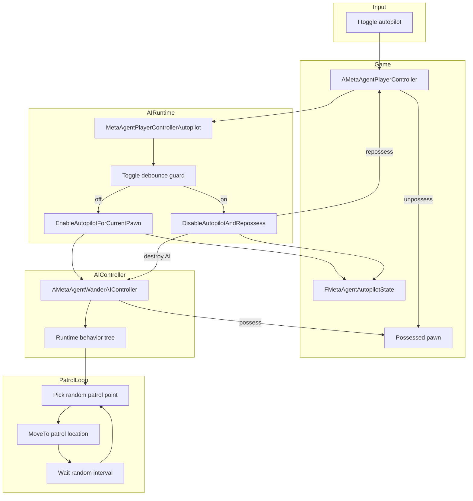

Module 6: 10 sequential runtime steps

1. Player presses `I` to toggle autopilot.
2. Debounce guards prevent rapid toggle spam.
3. Controller caches currently possessed pawn.
4. Controller spawns runtime AI controller (`AMetaAgentWanderAIController` by default).
5. Player controller unpossesses pawn.
6. AI controller possesses pawn and starts runtime behavior tree.
7. Runtime behavior tree sets a random patrol location.
8. AI moves to location, then waits random interval.
9. Loop repeats for continuous roaming.
10. Press `I` again to unpossess AI, destroy it, and restore player possession.

### Module 7: Particle orchestrator + runtime

Particle runtime improvements (orchestrator, scatter, forming)

Three focused upgrades to `UMetaAgentParticleRuntime` and its surrounding pipeline:

#### 1. Orchestrator layer (decoupled from player controller)

| Before | After |
|--------|-------|
| `AMetaAgentPlayerController` owned pattern config, preview, FSM triggers, and Niagara wiring inline | **`UMetaAgentParticleOrchestrator`** owns runtime, preview, config, and **`TriggerEffect(FName)`** |
| Keyboard binds scattered across controller | **`FMetaAgentParticleInputRouter`** centralizes binds + help lines |
| One-off effect logic in controller handlers | **`FMetaAgentParticleEffectSpec`** + **`MetaAgentParticleEffectIds`** catalog |

- Controller is a thin host: input, Niagara export callbacks, Blueprint API → orchestrator.
- **`UMetaAgentParticleRuntime`** still owns the master FSM, shape build, and actuation tick.
- Subclass **`UMetaAgentDefaultParticleOrchestrator`** (or your own) to register custom effect ids via `PopulateEffectSpec`.
- Removed unused keyboard binds (`A` attract, `X` spline, `M` mesh, `P` pattern toggle, `C` box sculpt, `V` image reveal, `1/2/3` play presets, `R` replay). Active map: `F`, `,`/`<<`, `.`/`>>`, `B/N`, `T`, `Y` (GUI **Play** / **<<** / **>>** mirror step controls).

#### 2. Image scatter grid (spatial spread across silhouette)

Targets are scattered across a **stratification grid** over the image mask — this is **spatial spread** of particle destinations, not the 1024px analysis resolution (`SampleResolution`).

| Tunable | Default | Role |
|---------|---------|------|
| `DensityGridScale` | **5.0** (max 16) | Grid cells ≈ `sqrt(particleCount × scale)` — higher = targets spread across more of the silhouette |
| `TargetJitterNormalized` | **0.7** (0–1) | Random offset within each grid cell |
| `GrayscaleGamma` | **1.0** | Flatter density weighting (was 1.2) |

- **`ScatterStratifiedFromMaskWeights()`** in `MetaAgentParticleImageMaskProcessor` — shared stratified scatter for **GrayscaleDensity** and **SobelEdges** (Sobel no longer picks only the top 4× strongest edges).
- Cycle sampling with **`T`** (`CycleSampling` effect): **GrayscaleDensity** → **SobelEdges** (legacy **FilledSilhouette** values sanitize to Gray).
- Console: `MetaAgent.Pattern.ScatterGrid <1-16>`, `.ScatterJitter <0-1>` — status text shows `ScatterGrid` / `stratGrid=NxN`.
- Rebuild after scatter changes: press **`F`**, then **`>>`** or GUI **Play**.

#### 3. Forming mode solvers (animated paths into Holding)

Forming is no longer a single lerp. **`FMetaAgentParticleFormingSolverRegistry`** selects motion during **Forming** while Holding / Returning stay unchanged.

| Mode | Runtime behavior |
|------|------------------|
| **DirectLerp** | Default — straight baseline → target by phase |
| **ArcLift** | Vertical arc (world Z) mid-form, settle on target |
| **SpiralIn** | Spiral inward around `PatternCenter` |

Legacy enum values (**StaggeredWave**, **SpringChase**, **NiagaraForces**) sanitize to **DirectLerp**.

- Config: **`FMetaAgentParticleFormingSettings`** on `FMetaAgentParticlePatternConfig` (category **Pattern | Forming**).
- Cycle with **`Y`** or `MetaAgent.Pattern.Forming Cycle` (`CycleForming` effect). Live switch mid-run updates `ActiveConfig.Forming`.
- Actuation: Direct buffer path calls the solver registry; Parameters/Hybrid also receive `MetaAgentFormingMode`, `MetaAgentFormingArcLift`, etc.
- Optional `FormCurve` on pattern assets still remaps forming phase before solvers run.

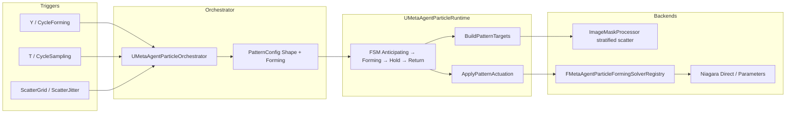

Particle orchestrator graph

- **`UMetaAgentParticleOrchestrator`** (abstract, Blueprint-subclassable) owns capture runtime, preview texture, pattern config, and routes **`TriggerEffect(FName)`** through the shared FSM.
- **`AMetaAgentPlayerController`** is a thin host: input, Niagara export callbacks, and Blueprint API delegate to the orchestrator.
- **`UMetaAgentParticleRuntime`** still owns the master FSM and Niagara readback/writeback.
- Tracks Niagara components in the active world (default name filter: `NIAGARA`).
- Captures ~1k particle world positions via direct C++ GPU readback (`FScopedNiagaraDataSetGPUReadback`) and CPU dataset access.
- Keyboard map (no `P` / skip-hold bind): `F` preview, `,` / `.` step pattern state backward / forward, `B/N` Slow / Dramatic presets, `T` cycle sampling, `Y` cycle forming mode. GUI panel (`Q`) adds **Play** (full auto cycle), **<<** / **>>**, and 64×64 **Source / Gray / Sobel** preview thumbnails in the Particle Runtime section.
- Every pattern start enters **Anticipating** first (attraction/orbit motion toward the shape center). Async PNG mask builds run during **Anticipating** — particles keep moving while the mask loads. Manual stepping is the default (`bManualPatternStateAdvance = true`); **Play** runs the full auto chain.
- State chain: **Anticipating → Forming → Holding → Returning → Idle** (legacy **Preparing** redirects to **Anticipating**).
- **Shape builder** (`FMetaAgentParticleShapeBuilder`) resolves target positions from configurable shapes (default: **ImageSilhouette** with **GrayscaleDensity** stratified scatter; mask analyzed at **1024px** `SampleResolution`; fallback: **SquareGrid**).
- Default **ShapeAnchor = ParticleCentroid**: grayscale image is centered on the particle cloud and auto-fitted to its bounding sphere; preview plane (`F`) is texture-only unless `PreviewPlane` anchor is set.
- PNG decode + shape sampling (**GrayscaleDensity** by default; **SobelEdges** optional) run on a **background thread** (`FMetaAgentParticleShapeCache`); the game thread stays responsive. Cache keys include PNG **file timestamp + size**, so replacing `sdxl_latest.png` on disk triggers a fresh build on the next `F` / pattern start.
- `F` loads `sdxl_latest.png` onto the preview plane and provides the shape texture.
- Pattern actuation writes blended positions back into Niagara simulation buffers (`PushCPUBuffersToGPU` on GPU emitters).
- Help panel (`Q`) shows capture status, consolidated Particle Runtime status (`State`, `Phase`, `Queue`, optional `loading mask`), preset/timings, active shape, and active gameplay tags.
- Timings + forming: **MetaAgent | Particles | Pattern** (`FMetaAgentParticlePatternConfig`); forming tunables under **Pattern | Forming**.
- Shape + scatter: **MetaAgent | Particles | Pattern | Shape** (`FMetaAgentParticleShapeDefinition`); `DensityGridScale`, `TargetJitterNormalized`, `GrayscaleGamma`.
- `B` / `N` = Slow / Dramatic preset (then `>>` or GUI **Play** to run).
- Anticipation tunables: **MetaAgent | Particles | Pattern | Anticipating** — `AnticipationAmplitudeCm`, `AnticipationFrequencyHz`.
- Console (PIE): `MetaAgent.Pattern.Form`, `.Hold`, `.Return`, `.Preset`, `.Status`, `.Shape`, `.ImageSampling Gray|Sobel`, `.Forming Lerp|Arc|Spiral`, `.ScatterGrid`, `.ScatterJitter`, `.EdgeThreshold`, `.ImageThreshold`, `.ShapeWidth`, `.Cancel`, `.SkipHold`, `.Ready`.
- **Forming solvers** (`FMetaAgentParticleFormingSolverRegistry`): DirectLerp (default), ArcLift, SpiralIn. Cycle with `Y` or `MetaAgent.Pattern.Forming Cycle`.
- Effect ids (`MetaAgentParticleEffectIds`): `ImageReveal`, `PatternStepForward`, `PatternStepBackward`, `PresetSlow`, `PresetDramatic`, `CycleSampling`, `CycleForming` (`PlayNormal` / `PlaySlow` / `PlayDramatic` / `ReplayLast` remain for Blueprint/console; spline/mesh/attract via console or `TriggerParticleEffect` only).
- Implemented in:
	- `Systems/ParticleRuntime/MetaAgentParticleOrchestrator.h/.cpp`
	- `Systems/ParticleRuntime/MetaAgentParticleEffectTypes.h/.cpp`
	- `Systems/ParticleRuntime/MetaAgentParticleInputRouter.h/.cpp`
	- `Systems/ParticleRuntime/MetaAgentParticleRuntime.h/.cpp`
	- `Systems/ParticleRuntime/MetaAgentParticlePatternTypes.h/.cpp`
	- `Systems/ParticleRuntime/MetaAgentParticleShapeTypes.h`
	- `Systems/ParticleRuntime/MetaAgentParticleShapeBuilder.h/.cpp`
	- `Systems/ParticleRuntime/MetaAgentParticleShapeCache.h/.cpp`
	- `Systems/ParticleRuntime/MetaAgentParticleImageMaskProcessor.h/.cpp`
	- `Systems/ParticleRuntime/MetaAgentImagePreviewRuntime.h/.cpp`
	- `Systems/ParticleRuntime/MetaAgentPlayerControllerParticles.cpp`
	- `Systems/ParticleRuntime/MetaAgentParticleShapeProvider.h`
	- `Systems/ParticleRuntime/MetaAgentParticleShapeRegistry.h/.cpp`
	- `Systems/ParticleRuntime/MetaAgentParticleActuatorTypes.h`
	- `Systems/ParticleRuntime/MetaAgentParticleActuation.h/.cpp`
	- `Systems/ParticleRuntime/MetaAgentParticleFormingTypes.h/.cpp`
	- `Systems/ParticleRuntime/MetaAgentParticleFormingSolver.h/.cpp`
	- `Systems/ParticleRuntime/MetaAgentParticlePatternAsset.h/.cpp`

#### Pattern state machine

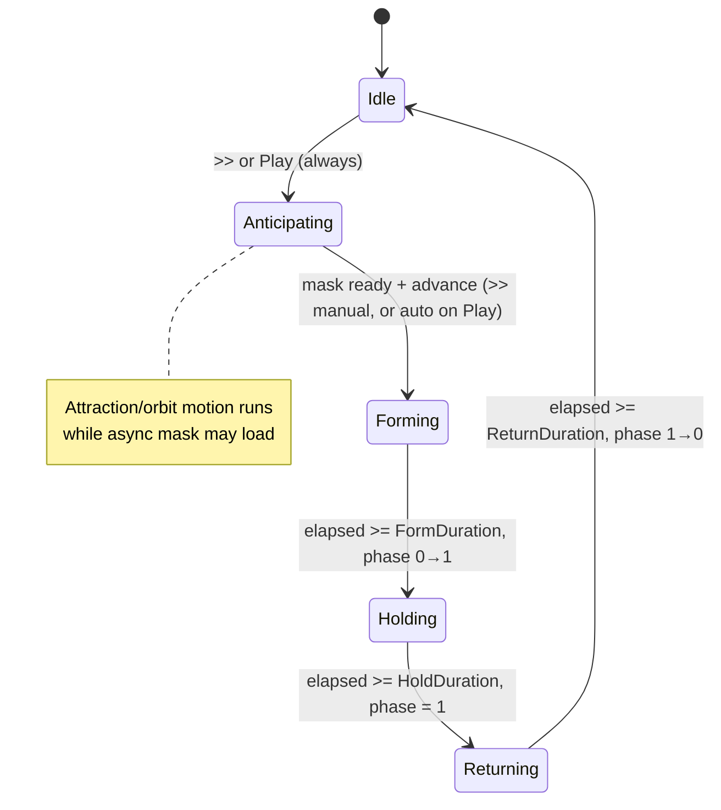

#### Orchestrator → runtime graph

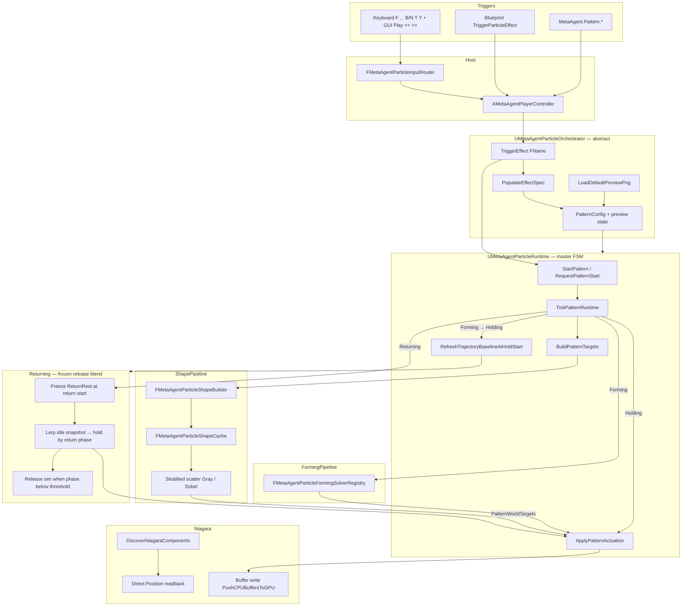

#### Return blend (stable release)

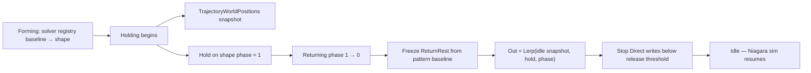

#### Shape pipeline

```mermaid
flowchart LR
    F[F key PNG] --> TEX[LatestPngPreviewTexture]
    STEP[>> / Play] --> SNAP[Snapshot baselines]
    SNAP --> BUILDER[FMetaAgentParticleShapeBuilder]
    TEX --> BUILDER
    CAM[Player camera ViewOrigin] --> FRAME[BuildShapeFrameFromCentroid]
    SNAP --> FRAME
    FRAME --> BUILDER
    BUILDER --> REG[FMetaAgentParticleShapeRegistry]
    REG --> IMG[ImageSilhouette provider]
    REG --> SPL[SplinePath provider]
    REG --> MSH[MeshSilhouette provider]
    REG --> GRID[SquareGrid fallback]
    IMG --> CACHE[FMetaAgentParticleShapeCache]
    CACHE --> IMG
    IMG --> SCATTER[ScatterStratifiedFromMaskWeights]
    SCATTER --> ASSIGN[PolarMatched assign]
    ASSIGN --> TGT[PatternWorldTargets]
    SPL --> TGT
    MSH --> TGT
    GRID --> TGT
    TGT --> CHOREO[Anticipating / Forming / Holding / Returning]
    CHOREO --> IDLE[Idle capture]
```

Module 7: sequential runtime steps

1. Runtime discovers tracked Niagara components (for example `NIAGARAFX` on `BP_NiagaraBridge`).
2. Direct capture reads particle `Position` attributes into `UMetaAgentParticleRuntime` snapshot cache.
3. Help panel reports `Particle Capture: TRUE (Count=N)` once data is available.
4. Player presses `F` to load `sdxl_latest.png` (preview plane texture + shape source path; GUI shows Source / Gray / Sobel thumbnails).
5. Player optionally presses `B` / `N` for Slow / Dramatic timing presets.
6. Player presses `>>` (or GUI **Play**) to start the pattern. **Play** disables manual advance and runs Anticipating → Forming → Holding → Returning automatically; `>>` steps one state at a time (default).
7. Runtime snapshots baselines and freezes timings + shape config for the run; state enters **Anticipating** with attraction/orbit actuation (`AnticipationAmplitudeCm`, `AnticipationFrequencyHz`).
8. `FMetaAgentParticleShapeCache` loads/decodes the PNG and runs the selected sampler (`GrayscaleDensity` default) on a worker thread at `SampleResolution` (1024px default). If the mask is not ready yet, **Anticipating** continues with visible motion and panel status shows `loading mask`.
9. `FMetaAgentParticleImageMaskProcessor` stratifies targets across the mask (`DensityGridScale` × `TargetJitterNormalized`); Gray and Sobel share `ScatterStratifiedFromMaskWeights`. `FMetaAgentParticleShapeBuilder` assigns targets (polar-matched on image silhouettes, or square grid fallback).
10. On advance to **Forming**, `FMetaAgentParticleFormingSolverRegistry` moves particles baseline → targets by active mode (`DirectLerp` default; cycle with `Y`). Optional `FormCurve` remaps phase.
11. GPU emitters: readback → solver/blend → modify CPU float buffer → `PushCPUBuffersToGPU` (Parameters/Hybrid also push `MetaAgentForming*` user params).
12. `Holding` locks phase at 1 on the resolved shape.
13. `Returning` drives phase 1→0 while blending from the held shape toward a **frozen idle snapshot** (`BaselineWorldPositions` captured at pattern start). Rest targets are not refreshed each tick (avoids Direct-write feedback flicker).
14. When return phase drops below `ReturnReleaseAuthorityThreshold`, Direct buffer writes stop and Niagara regains sim control before **Idle**.
15. On completion, state returns to `Idle` and normal capture resumes.
16. Blueprint API: `TriggerParticleEffect(EffectId)`, `GetParticleOrchestrator()`, `StartParticlePattern()`, `RequestPatternStart(Asset)`, `RequestPatternCancel()`, `RequestSkipHold()`, `RequestPatternQueue(Asset)`, plus legacy `StartParticleSquarePattern()`.

#### Command layer architecture

`UMetaAgentParticleOrchestrator` routes external triggers; `UMetaAgentParticleRuntime` owns the FSM. Blueprint, COMMS, and console issue **effects, commands, and config** only.

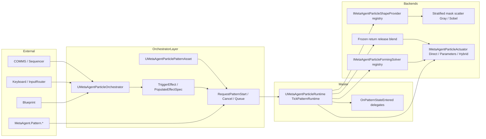

- **Pattern data assets:** primary type `MetaAgentParticlePattern` (see `Config/DefaultGame.ini`). In editor, run `MetaAgent.CreateSamplePatternAssets` to generate Normal / Slow / Dramatic samples under `/MetaAgentPlugin/MetaAgent/Patterns`.
- **Packaged Niagara actuation:** see `Content/MetaAgent/Niagara/PARAMETERS.md` for `MetaAgentPattern*` and `MetaAgentForming*` user parameters.

## License

Licensed under the [MIT License](./LICENSE).