# MetaAgentPlugin

Under heavy development. 

- UE5 plugin with several runtimes for a multimodal agent with Humanoid structure.
- Modules: MetaAgentPlugin (Runtime), MetaAgentPluginEditor (Editor).

Objective: Allow an active agent to control the cinematic area. This plugin creates new levels and has default BPs to use. 

## Flowchart

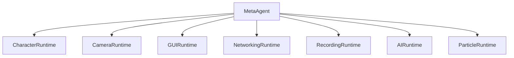

Architecture

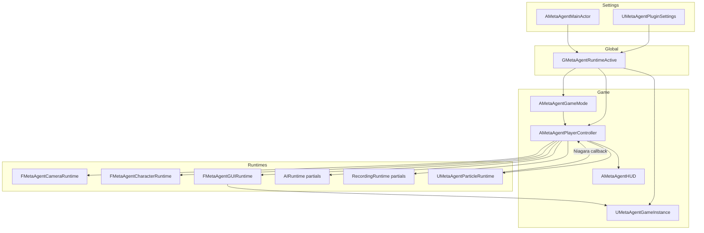

## Modules

### Module 1 : MetaAgentCharacterRuntime

CharacterRuntime Graph

- Default pawn spawn and possession via game mode
- Blueprint-owned camera/mesh/animation setup
- Minimal runtime bootstrap (no recovery pipeline)
- Implemented in:
	- `Systems/CharacterRuntime/MetaAgentCharacterRuntime.h`
	- `Systems/CharacterRuntime/MetaAgentCharacterRuntime.cpp`

#### Character runtime graph

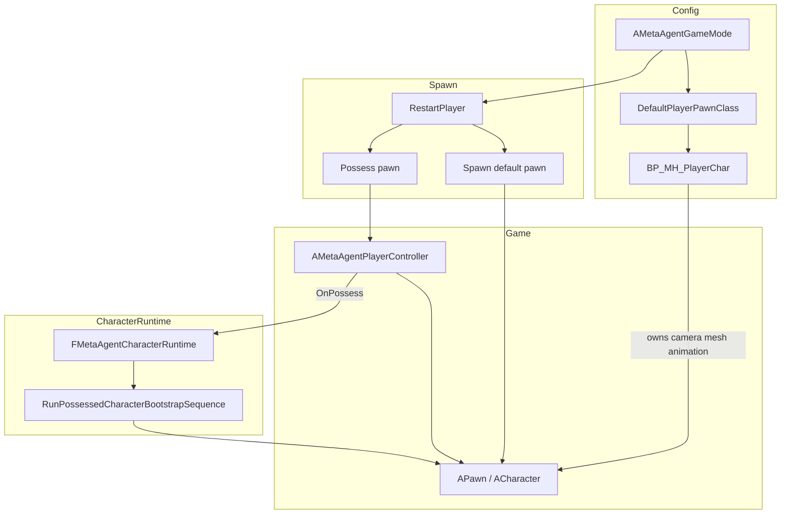

Module 1: simplified runtime flow

1. Resolve `DefaultPlayerPawnClass` from `MetaAgentGameMode` config.
2. Spawn and possess the default pawn through standard `AGameModeBase::RestartPlayer`.
3. Keep CharacterRuntime bootstrap minimal (no mesh/anim recovery pipeline).
4. Let `BP_MH_PlayerChar` own camera, mesh, and animation setup directly.

### Module 2: MetaAgentCameraRuntime (Environment Viewer)

CameraRuntime Graph

- Environment-only camera system for pure scene exploration
- Free-look with mouse and keyboard movement
- Mouse wheel zoom for distance control
- Cinematic orbital camera mode (`O`)
- Simplified for viewer-only without character dependencies
- Implemented in:
	- `Systems/CameraRuntime/MetaAgentCameraRuntime.h`
	- `Systems/CameraRuntime/MetaAgentCameraRuntime.cpp`

#### Camera runtime graph

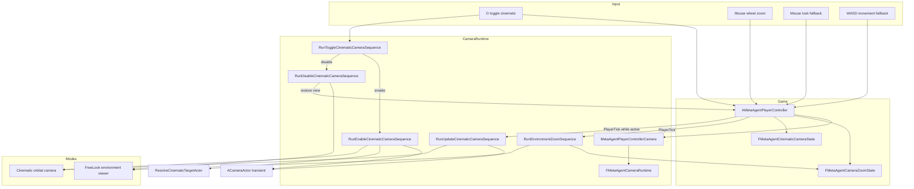

Module 2: Simplified runtime steps (environment viewing only)

1. Keep `AMetaAgentPlayerController` as the input owner for camera actions.
2. Route all camera execution through `FMetaAgentCameraRuntime` sequences.
3. Keep `FMetaAgentCameraZoomState` in the controller for zoom interpolation and bounds.
4. Consume discrete mouse-wheel up/down zoom input (step in/out).
5. Consume analog wheel-axis zoom input for smooth zooming.
6. Interpolate camera zoom distance toward desired distance.
7. Clamp zoom distances to configured min/max bounds (40–1500 units).
8. Clamp and sanitize zoom tuning values before runtime use.
9. Route `O` toggle handling through runtime cinematic-toggle sequence.
10. Enable cinematic mode through runtime camera-activation sequence (smooth orbital motion).
11. Disable cinematic mode through runtime camera-teardown sequence (restore free-look).
12. Update cinematic camera every frame through runtime update sequence.
13. Spawn a transient runtime `ACameraActor` when cinematic mode starts.
14. Reuse existing runtime cinematic camera actor when still valid.
15. Rebuild runtime cinematic camera actor when stale or world-mismatched.
16. Preserve pre-cinematic view state for deterministic restore on exit.
17. Restore view to free-look mode on cinematic exit.
18. Keep player input fully enabled during all camera modes (free exploration).
19. Apply oscillating-hold cinematic motion style (smooth sway around focus point).
20. Apply runtime sway and look-at behavior for cinematic framing.
21. Auto-disable cinematic mode when runtime camera prerequisites are lost.
22. Keep the runtime camera module extensible for additional orbital styles.

### Module 3: MetaAgentGUIRuntime

GUIRuntime Graph

- Runtime GUI panel orchestration owned by a dedicated module
- HUD help panel visibility toggle bound to keyboard (`Q`)
- Keyboard-function reference panel rendered when GUI help is active
- Implemented in:
	- `Systems/GUIRuntime/MetaAgentGUIRuntime.h`
	- `Systems/GUIRuntime/MetaAgentGUIRuntime.cpp`
	- `Systems/GUIRuntime/MetaAgentPlayerControllerGUI.cpp`

#### GUI runtime graph

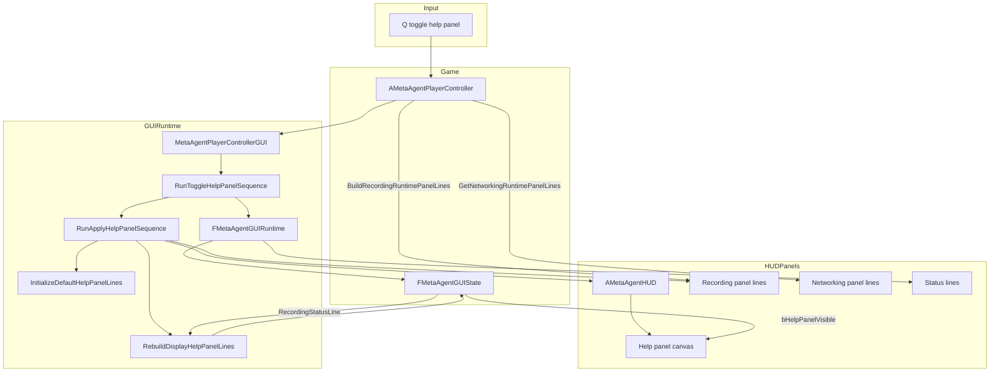

Module 3: 20 sequential runtime steps

1. Keep `AMetaAgentPlayerController` as input owner for GUI toggle actions.
2. Route GUI panel behavior through `FMetaAgentGUIRuntime` sequences.
3. Keep `FMetaAgentGUIState` in the controller as runtime GUI state storage.
4. Bind `Q` key in controller utility input setup for help panel toggling.
5. Handle `Q` key press through a dedicated controller-to-runtime bridge.
6. Initialize default keyboard-help lines on first GUI runtime application.
7. Keep help panel lines cached in runtime GUI state for deterministic redraw.
8. Apply GUI runtime state to HUD through explicit runtime apply sequence.
9. Push canonical help lines from GUI runtime to HUD each apply cycle.
10. Push help-panel visibility flag from GUI runtime to HUD each apply cycle.
11. Toggle help-panel visibility state in runtime sequence on each `Q` press.
12. Emit runtime log entries when help panel visibility changes.
13. Keep GUI toggle behavior free of transient keypress popup text.
14. Render help panel title and key-function rows via HUD canvas drawing.
15. Include active runtime key rows for recording (`J`/`U`) and COMMS (`H`/`G`).
16. Include fallback movement and look controls (`W/A/S/D`, `Shift`, mouse, wheel).
17. Keep help panel render path independent from status panel availability.
18. Keep recording status integrated into the main help panel with a separator row.
19. Preserve existing camera, autopilot, and recording runtime behavior unchanged.
20. Keep GUI runtime extensible for future panel types beyond controls help.

### Module 4: MetaAgentNetworkingRuntime

NetworkingRuntime Graph

- Runtime networking orchestration through `UMetaAgentGameInstance`
- Embedded HTTP server for editor, standalone, and packaged runtime builds
- Runtime outbound platform event forwarding and inbound notify handling
- Bottom-left Networking Runtime GUI panel shown when GUI (`Q`) is active
- Implemented in:
	- `Systems/NetworkingRuntime/MetaAgentGameInstanceNetworking.cpp`
	- `Systems/NetworkingRuntime/MetaAgentGameInstance.h`
	- `Systems/NetworkingRuntime/MetaAgentGameInstance.cpp`

#### Networking runtime graph

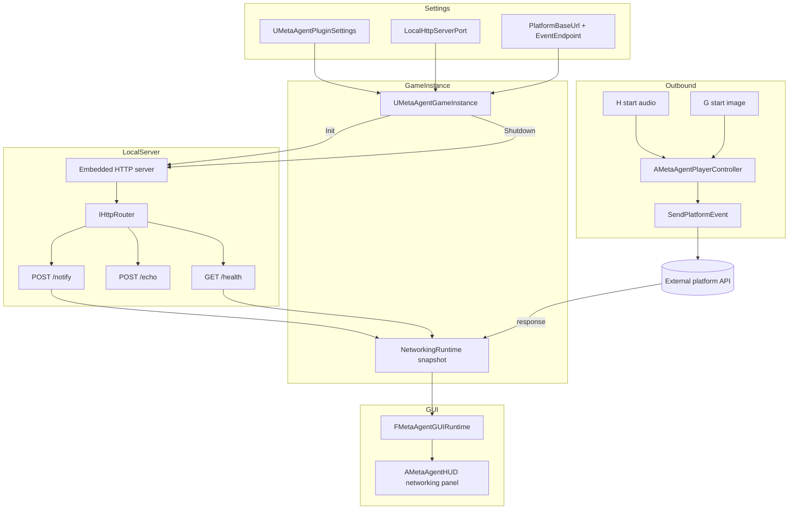

Module 4: 20 sequential runtime steps

1. Keep `UMetaAgentGameInstance` as the runtime networking owner.
2. Initialize NetworkingRuntime snapshot state during game instance startup.
3. Start local HTTP server during runtime init when networking is enabled.
4. Embed server behavior in editor, standalone, and packaged runtime builds.
5. Bind `/health` endpoint for runtime health checks.
6. Bind `/echo` endpoint for payload round-trip checks.
7. Bind `/notify` endpoint for external notifications.
8. Start listeners after routes are bound.
9. Track router/listener state in runtime snapshot fields.
10. Expose runtime server status through `GetLocalHttpServerStatusText`.
11. Build platform forwarding URL from configured base and endpoint.
12. Send outbound platform events with runtime metadata payload.
13. Track last event name, send time, receive time, and result status.
14. Track HTTP/network errors in runtime snapshot fields.
15. Parse platform response payload for agent action/running state.
16. Track latest notify message from `/notify` requests.
17. Stop server and unbind routes during game instance shutdown.
18. Expose formatted NetworkingRuntime panel lines to GUI runtime.
19. Draw bottom-left networking rectangle only while GUI panel is active.
20. Keep networking runtime extensible for future endpoint families.

### Module 5: MetaAgentRecordingRuntime

RecordingRuntime Graph

- Runtime recording based on Unreal Engine Movie Scene Capture (FrameGrabber, no HiResShot loop)
- `J` toggles viewport capture start/stop and writes an AVI video file directly to disk
- Video is captured from the active player viewport at a fixed FPS (default 30)
- Output directory is created under `Saved/Renders/Capture_YYYYMMDD_HHMMSS`
- `U` finalizes capture (if active) and reports output/status summary
- Recording panel shows runtime capture state, resolution, frame count, and output path
- Video compression can be toggled on the player controller (`bUseVideoCompression`, `VideoCompressionQuality`)
- Implemented in:
	- `Systems/RecordingRuntime/MetaAgentPlayerControllerRecording.cpp`

#### Recording runtime graph

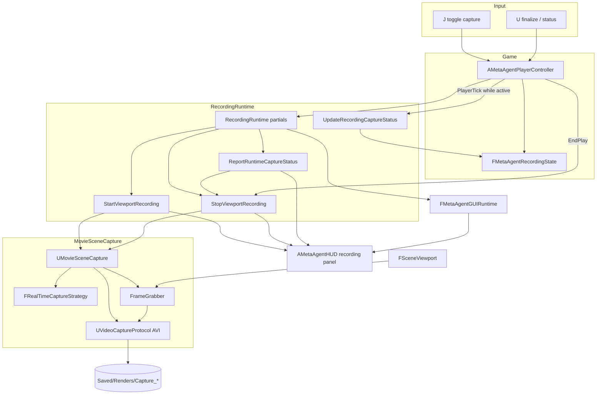

Module 5: 12 sequential runtime steps

1. Press `J` to start viewport video capture.
2. Initialize a new output folder in `Saved/Renders`.
3. Configure Movie Scene Capture with `UVideoCaptureProtocol` (AVI output).
4. Bind capture to the local game viewport and start recording.
5. Capture at configured fixed FPS (default 30 FPS).
6. Engine FrameGrabber streams frames into the AVI writer while gameplay continues.
7. Update recording runtime panel line values continuously.
8. Press `J` again to stop capture and finalize the AVI file.
9. Keep the captured video in the output directory.
10. Press `U` to finalize/status summary for the current or last capture session.
11. Use the output AVI directly or transcode externally if needed.
12. Capture resolution defaults to viewport size; optional override via recording settings.

### Module 6: MetaAgentAIRuntime

AIRuntime Graph

- Runtime AI wander controller (`AMetaAgentWanderAIController`) builds and runs a behavior tree in code.
- Autopilot toggle logic (`AMetaAgentPlayerController`) now lives in AIRuntime and hands possession to AI.
- Autopilot runtime toggle key is `I`.
- AI behavior is simple patrol wandering:
	- pick random patrol point in radius
	- move to patrol point
	- wait for random interval
	- repeat
- Implemented in:
	- `Systems/AIRuntime/MetaAgentWanderAIController.cpp`
	- `Systems/AIRuntime/MetaAgentPlayerControllerAutopilot.cpp`

#### AI runtime graph

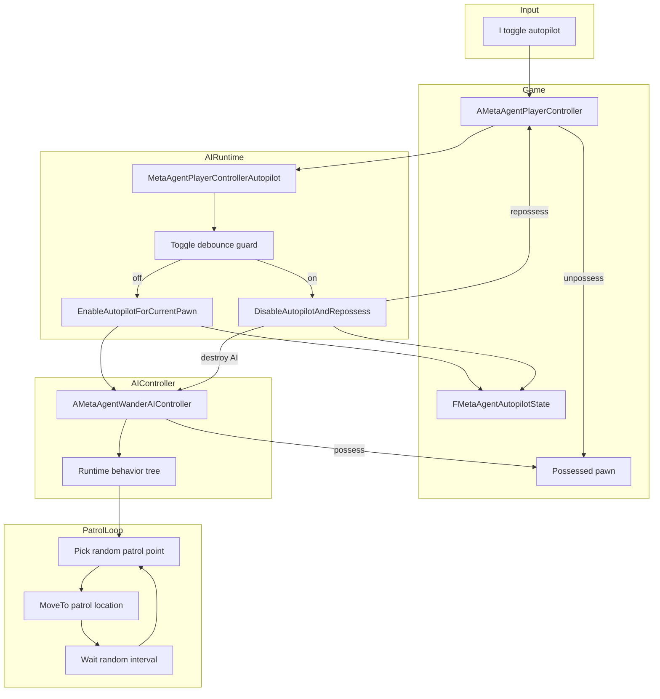

Module 6: 10 sequential runtime steps

1. Player presses `I` to toggle autopilot.
2. Debounce guards prevent rapid toggle spam.
3. Controller caches currently possessed pawn.
4. Controller spawns runtime AI controller (`AMetaAgentWanderAIController` by default).
5. Player controller unpossesses pawn.
6. AI controller possesses pawn and starts runtime behavior tree.
7. Runtime behavior tree sets a random patrol location.
8. AI moves to location, then waits random interval.
9. Loop repeats for continuous roaming.
10. Press `I` again to unpossess AI, destroy it, and restore player possession.

### Module 7: MetaAgentParticleRuntime

ParticleRuntime Graph

- Tracks Niagara components in the active world (default name filter: `NIAGARA`).
- Captures ~1k particle world positions via direct C++ GPU readback (`FScopedNiagaraDataSetGPUReadback`) and CPU dataset access.
- `V` plays particle choreography: **Preparing → Forming → Holding → Returning → Idle** (image silhouette default; async mask when needed).
- `C` plays **RandomParallelepiped** box sculpt: random 3D parallelepiped inside the particle bounding sphere — **Forming → Holding → Returning → Idle** with **Sculpt** preset (1.6 / 0.4 / 1.2 s), no async prepare step.
- **Shape builder** (`FMetaAgentParticleShapeBuilder`) resolves target positions from configurable shapes (default: **ImageSilhouette** with **GrayscaleDensity** scatter at **1024px**; fallback: **SquareGrid**; **RandomParallelepiped** for C-key sculpt).
- Default **ShapeAnchor = ParticleCentroid**: grayscale image is centered on the particle cloud and auto-fitted to its bounding sphere; preview plane (`F`) is texture-only unless `PreviewPlane` anchor is set.
- **RandomParallelepiped** samples **volume** (40%), **surface** (40%), and **halo** (20%) targets inside the cloud sphere; nearest-neighbor assignment sends outer particles toward halo/surface and inner particles toward volume — trajectories cross inward/outward through the sphere.
- PNG decode + shape sampling (**GrayscaleDensity** by default; Sobel/Fill optional) run on a **background thread** (`FMetaAgentParticleShapeCache`); the game thread stays responsive. Cache keys include PNG **file timestamp + size**, so replacing `sdxl_latest.png` on disk triggers a fresh build on the next `F`/`V`.
- `F` loads `sdxl_latest.png` onto the preview plane and provides the shape texture.
- Pattern actuation writes blended positions back into Niagara simulation buffers (`PushCPUBuffersToGPU` on GPU emitters).
- Help panel (`Q`) shows capture status, preset/timings, active shape, and live pattern state.
- Timings: **MetaAgent | Particles | Pattern** (`FMetaAgentParticlePatternConfig`).
- Shape: **MetaAgent | Particles | Pattern | Shape** (`FMetaAgentParticleShapeDefinition`); box tuning under **Shape | RandomBox**.
- `B` = Slow preset, `N` = Dramatic preset, `C` = Sculpt random box. Press `V` for image pattern after choosing timings.
- Console (PIE): `MetaAgent.Pattern.Form`, `.Hold`, `.Return`, `.Preset`, `.Status`, `.Shape`, `.Box`, `.ImageSampling Gray|Fill|Sobel`, `.EdgeThreshold`, `.ImageThreshold`, `.ShapeWidth`, `.Cancel`, `.SkipHold`, `.Ready`.
- Implemented in:
	- `Systems/ParticleRuntime/MetaAgentParticleRuntime.h/.cpp`
	- `Systems/ParticleRuntime/MetaAgentParticlePatternTypes.h/.cpp`
	- `Systems/ParticleRuntime/MetaAgentParticleShapeTypes.h`
	- `Systems/ParticleRuntime/MetaAgentParticleShapeBuilder.h/.cpp`
	- `Systems/ParticleRuntime/MetaAgentParticleShapeCache.h/.cpp`
	- `Systems/ParticleRuntime/MetaAgentParticleImageMaskProcessor.h/.cpp`
	- `Systems/ParticleRuntime/MetaAgentImagePreviewRuntime.h/.cpp`
	- `Systems/ParticleRuntime/MetaAgentPlayerControllerParticles.cpp`

#### Pattern state machine

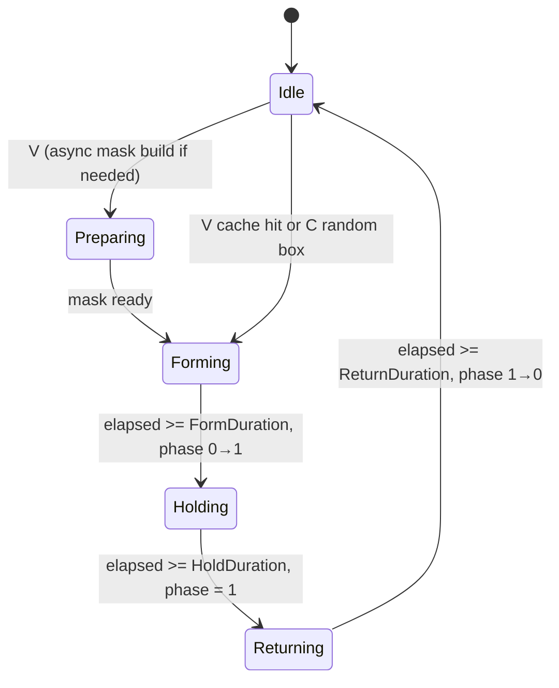

#### Random box sculpt (C key)

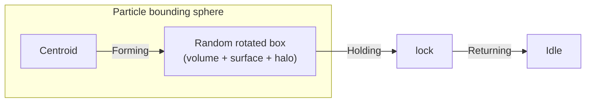

- Each `C` press picks a new **random seed**, **half-extents**, and **rotation** (box corners stay inside ~90% of cloud radius).
- Target mix (defaults): **40%** interior volume, **40%** face surface, **20%** outward halo (scaled 1.15–1.35×, clamped to sphere).
- **NearestNeighbor** assignment: particles outside the core tend toward halo/face targets; inner particles toward volume — crossing trajectories through the sphere.
- Tunables on `FMetaAgentParticleShapeDefinition` under **RandomBox** (`BoxMinSizeFractionOfSphere`, `BoxVolumeSampleFraction`, `BoxRandomSeed`, etc.).

#### Particle runtime graph

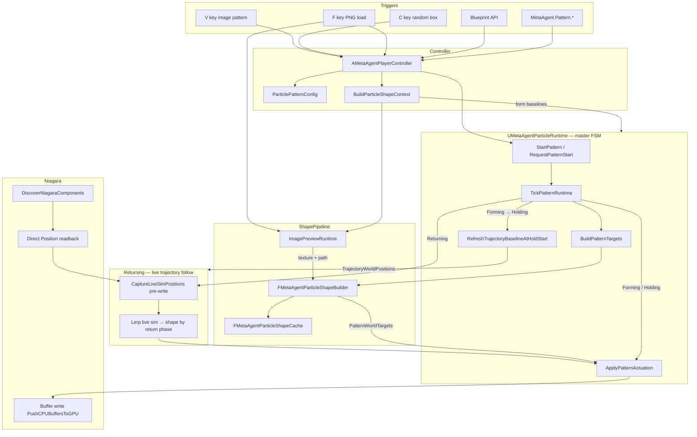

#### Return blend (live sim follow)

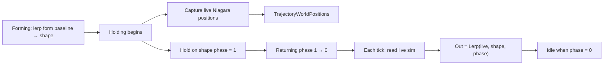

#### Shape pipeline

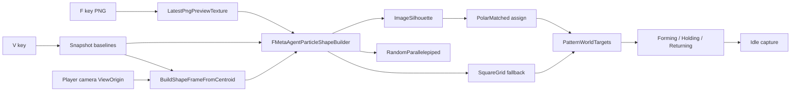

Module 7: sequential runtime steps

1. Runtime discovers tracked Niagara components (for example `NIAGARAFX` on `BP_NiagaraBridge`).
2. Direct capture reads particle `Position` attributes into `UMetaAgentParticleRuntime` snapshot cache.
3. Help panel reports `Particle Capture: TRUE (Count=N)` once data is available.
4. Player presses `F` to load `sdxl_latest.png` (preview plane texture + shape source path).
5. Player optionally presses `B` / `N` for timing presets.
6. Player presses `V` to start the pattern.
7. Runtime snapshots baselines and freezes timings + shape config for the run.
8. `FMetaAgentParticleShapeCache` loads/decodes the PNG and runs the selected sampler (`GrayscaleDensity` default) on a worker thread (1024px by default). If not ready yet, state is **Preparing** and the game keeps running.
9. `FMetaAgentParticleShapeBuilder` builds `PatternWorldTargets` (image silhouette centered on particle centroid, polar-matched assignment, or square grid fallback).
10. State machine enters `Forming` and lerps baseline → targets (phase 0→1).
11. GPU emitters: readback → modify CPU float buffer → `PushCPUBuffersToGPU`.
12. `Holding` locks phase at 1 on the resolved shape.
13. `Returning` drives phase 1→0 while blending from the shape toward **live Niagara positions** read each tick (not the pattern-start baseline).
14. When **Holding** begins, live positions are captured into `TrajectoryWorldPositions` as the return reference fallback.
15. On completion, state returns to `Idle` and normal capture resumes.
16. Blueprint API: `StartParticlePattern()`, `RequestPatternStart(Asset)`, `RequestPatternCancel()`, `RequestSkipHold()`, `RequestPatternQueue(Asset)`, plus legacy `StartParticleSquarePattern()`.

Module 7: Particle enhancement roadmap (Phase 0–4) — implemented

Design rule: **`UMetaAgentParticleRuntime` FSM remains the single choreography authority.** Gameplay, COMMS, Blueprint, and StateTree issue **commands and config**; they never advance phase or write Niagara buffers directly.

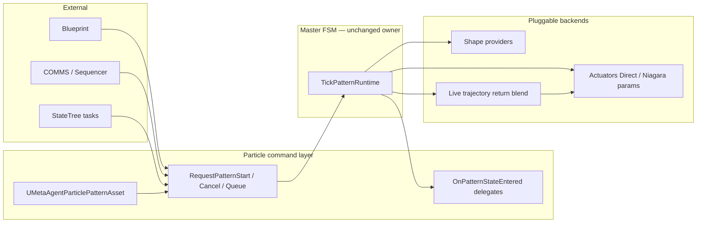

---

#### Phase 0 — Foundation (commands, events, data asset)

**Goal:** Blueprint and gameplay can trigger, observe, and interrupt patterns without changing shape math or FSM ownership.

| # | Task | Files | Deliverable |
|---|------|-------|-------------|
| 0.1 | Add delegate types | `MetaAgentParticlePatternTypes.h` | `FOnMetaAgentPatternStateChanged`, `FOnMetaAgentPatternCompleted` |
| 0.2 | Broadcast from `EnterPatternState` | `MetaAgentParticleRuntime.cpp` | BlueprintAssignable events on runtime |
| 0.3 | Forward events on controller | `MetaAgentPlayerController.h/.cpp`, `MetaAgentPlayerControllerParticles.cpp` | BP hooks without touching runtime object |
| 0.4 | `RequestPatternCancel(bSkipReturn)` | `MetaAgentParticleRuntime.h/.cpp` | Forming/Holding/Preparing → Returning or Idle |
| 0.5 | `RequestSkipHold()` | same | Holding → Returning immediately |
| 0.6 | `IsPatternReady(ImagePath)` | `MetaAgentParticleShapeCache.h/.cpp` | Query mask cache without starting pattern |
| 0.7 | `CanStartPattern()` | `MetaAgentParticleRuntime` | True when Idle (or document Preparing policy) |
| 0.8 | Rename API | `MetaAgentParticleRuntime.h`, controller | `StartPattern()` primary; `StartSquarePattern()` deprecated alias |
| 0.9 | Create `UMetaAgentParticlePatternAsset` | new `.h/.cpp` | Primary Data Asset wrapping `FMetaAgentParticlePatternConfig` + optional soft image path |
| 0.10 | `RequestPatternStart(Asset*)` | runtime + controller | Applies asset config, then existing start flow |
| 0.11 | Console + help panel | `MetaAgentPlayerControllerParticles.cpp`, `MetaAgentGUIRuntime.cpp` | `MetaAgent.Pattern.Cancel`, `.SkipHold`, `.Ready` |
| 0.12 | README + UHT | Build.cs if needed | Module 7 docs updated |

**Exit criteria:** PIE test — start pattern, receive BP event on Holding, cancel mid-Forming, start from Data Asset.

---

#### Phase 1 — Data-driven tuning and queue

**Goal:** Designers author pattern libraries; multi-beat sequences and richer motion without new FSM states.

| # | Task | Files | Deliverable |
|---|------|-------|-------------|
| 1.1 | Add `UCurveFloat*` to pattern asset | `MetaAgentParticlePatternAsset` | `FormCurve`, `ReturnCurve` (optional) |
| 1.2 | Curve remap in actuation | `MetaAgentParticleRuntime.cpp` | Phase = `Curve->GetFloatValue(NormalizedTime)` instead of smoothstep only |
| 1.3 | Add GameplayTags module dep | `MetaAgentPlugin.Build.cs`, `.uplugin` | `GameplayTags` |
| 1.4 | Pattern tags on asset + runtime | asset + `FMetaAgentParticlePatternRuntime` | e.g. `Pattern.ImageReveal`, `Pattern.Active` |
| 1.5 | `RequestPatternQueue(Asset*)` | runtime | FIFO max N (default 3); drain at Idle |
| 1.6 | Block start when tag present | controller or runtime | Optional `BlockedPatternTags` on controller |
| 1.7 | HUD queue + tag display | `MetaAgentGUIRuntime.cpp`, help panel | Show queue depth + active tag |
| 1.8 | GPU actuation packaged fix | `MetaAgentParticleRuntime.cpp` | Remove or guard `#if WITH_EDITOR`; fallback path documented |
| 1.9 | Asset Manager primary asset type | plugin settings or `DefaultGame.ini` snippet | `UMetaAgentParticlePatternAsset` registrable |
| 1.10 | Sample content assets | `Content/MetaAgent/Patterns/` | Normal / Slow / Dramatic `.uasset` examples |

**Exit criteria:** Queue 2 assets back-to-back; Form uses custom curve; packaged build actuates CPU emitters; tags visible in help panel.

---

#### Phase 2 — Pluggable shape providers

**Goal:** New formations ship as providers or assets; `BuildPatternTargets` switch replaced by registry.

| # | Task | Files | Deliverable |
|---|------|-------|-------------|
| 2.1 | Define `IMetaAgentParticleShapeProvider` | new `MetaAgentParticleShapeProvider.h` | `CanBuild`, `BuildTargets`, `GetShapeId`, priority |
| 2.2 | Shape registry singleton/module | `MetaAgentParticleShapeRegistry.h/.cpp` | Register / resolve by `EMetaAgentParticlePatternShape` or tag |
| 2.3 | Migrate `BuildSquareGridTargets` | new `MetaAgentParticleShapeProviderGrid.cpp` | Existing logic unchanged, wrapped |
| 2.4 | Migrate `BuildImageSilhouetteTargets` | new `MetaAgentParticleShapeProviderImage.cpp` | Existing mask cache path preserved |
| 2.5 | Refactor builder dispatch | `MetaAgentParticleShapeBuilder.cpp` | Registry lookup + fallback provider |
| 2.6 | **SplinePath provider** | new provider + enum value | Sample `USplineComponent` actor tag; points along arc length |
| 2.7 | **MeshSilhouette provider** | new provider | Ortho projection of static mesh bounds → local points |
| 2.8 | Async prepare hook on provider | provider interface optional | Mirror `bAwaitingAsyncMask` for heavy mesh bakes |
| 2.9 | Shape selection on pattern asset | `UMetaAgentParticlePatternAsset` | Override shape type + provider-specific params struct |
| 2.10 | Console `.Shape Spline|Mesh|Image|Grid` | `MetaAgentPlayerControllerParticles.cpp` | Runtime shape swap before V |

**Exit criteria:** All four shape types run through registry; ImageSilhouette + SquareGrid behavior matches pre-refactor; one spline level demo.

---

#### Phase 3 — Pluggable actuators (Niagara-native)

**Goal:** Packaged GPU sims and VFX-authored motion; C++ buffer write becomes one actuator mode.

| # | Task | Files | Deliverable |
|---|------|-------|-------------|
| 3.1 | Define `IMetaAgentParticleActuator` | new `MetaAgentParticleActuator.h` | `ApplyPhase`, `Reset`, `SupportsComponent` |
| 3.2 | **DirectBufferActuator** | new `.cpp` | Move current `ApplyPatternActuation` logic |
| 3.3 | **NiagaraParameterActuator** | new `.cpp` | Set `MetaAgentPatternPhase`, `MetaAgentPatternCenter`, `MetaAgentPatternActive` on tracked components |
| 3.4 | Actuator selection on runtime | `MetaAgentParticleRuntime` | `EMetaAgentParticleActuationMode`: Direct, Parameters, Hybrid |
| 3.5 | Niagara system module doc + sample | `Content/MetaAgent/Niagara/` | User parameter lerp module (artist-facing) |
| 3.6 | Optional custom DI | C++ DI class + `.h` | Read target array or mask texture on GPU (stretch) |
| 3.7 | Hybrid routing | runtime tick | PIE Direct + packaged Parameters auto-select |
| 3.8 | Color / scale params during Holding | actuator + asset | Pulse emissive via `MetaAgentPatternHoldScale` |
| 3.9 | Steering blend on Forming entry | `MetaAgentParticleRuntime.cpp` | Optional mix baseline→target with steering vectors first 0.2s |
| 3.10 | Per-component index ranges | snapshot struct | Fix multi-emitter actuation scope (prerequisite for 3.2) |

**Exit criteria:** Same pattern plays in PIE (Direct) and packaged (Parameters); Niagara asset controls lerp; multi-emitter actuation scoped correctly.

---

#### Phase 4 — Live trajectory return (Returning → Idle blend)

**Goal:** Return eases from the held shape back into idle Niagara motion in one continuous **Returning** phase — no extra post-return animation.

| # | Task | Files | Deliverable |
|---|------|-------|-------------|
| 4.1 | Capture trajectory at Holding start | `MetaAgentParticleRuntime.cpp` | `TrajectoryWorldPositions` from live read |
| 4.2 | Live sim read each Returning tick | same | `CaptureLiveSimPositions` before actuation |
| 4.3 | Return actuation uses live blend | `MetaAgentParticleActuation.cpp` | `Lerp(live, shape, phase)` during Returning |
| 4.4 | Forming still uses pattern-start baseline | actuation | Form vs return blend sources separated |
| 4.5 | Remove separate Releasing handoff | runtime FSM | Returning → Idle directly |

**Exit criteria:** PIE test — return follows ambient particle motion with no expand/compress pop at the end; FSM diagram unchanged (`Returning → Idle`).

---

#### Cross-phase dependency order

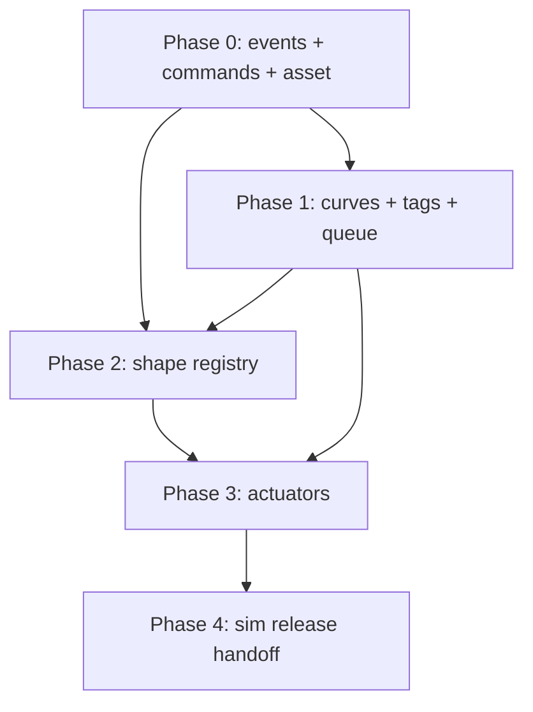

- **Phase 0** must land first (events + asset are used everywhere).
- **Phase 1** can partially parallel **Phase 2** after task 0.9 (asset exists).
- **Phase 3** task 3.10 should start early (multi-emitter fix helps Direct actuator).
- **Phase 4** (COMMS auto-pipeline, StateTree tasks) is out of scope here; hooks come from Phase 0 delegates + commands.

---

#### Suggested implementation sprints

| Sprint | Scope | Duration |
|--------|-------|----------|
| S1 | Phase 0.1–0.8 | ~3–4 days |
| S2 | Phase 0.9–0.12 + Phase 1.1–1.2 | ~3–4 days |
| S3 | Phase 1.3–1.10 | ~4–5 days |
| S4 | Phase 2.1–2.5 (registry + migration) | ~4–5 days |
| S5 | Phase 2.6–2.10 (new shapes) | ~4–5 days |
| S6 | Phase 3.1–3.4 + 3.10 | ~5 days |
| S7 | Phase 3.5–3.9 (Niagara content + polish) | ~5 days |

**Total estimate:** ~5–7 weeks for one developer, end-to-end, with PIE validation after each sprint.

## License

Licensed under the [MIT License](./LICENSE).