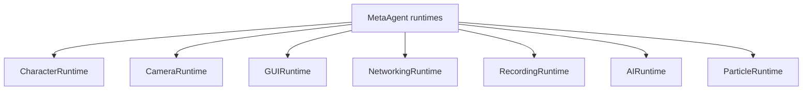
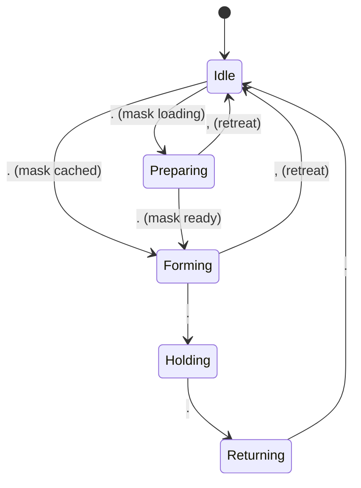
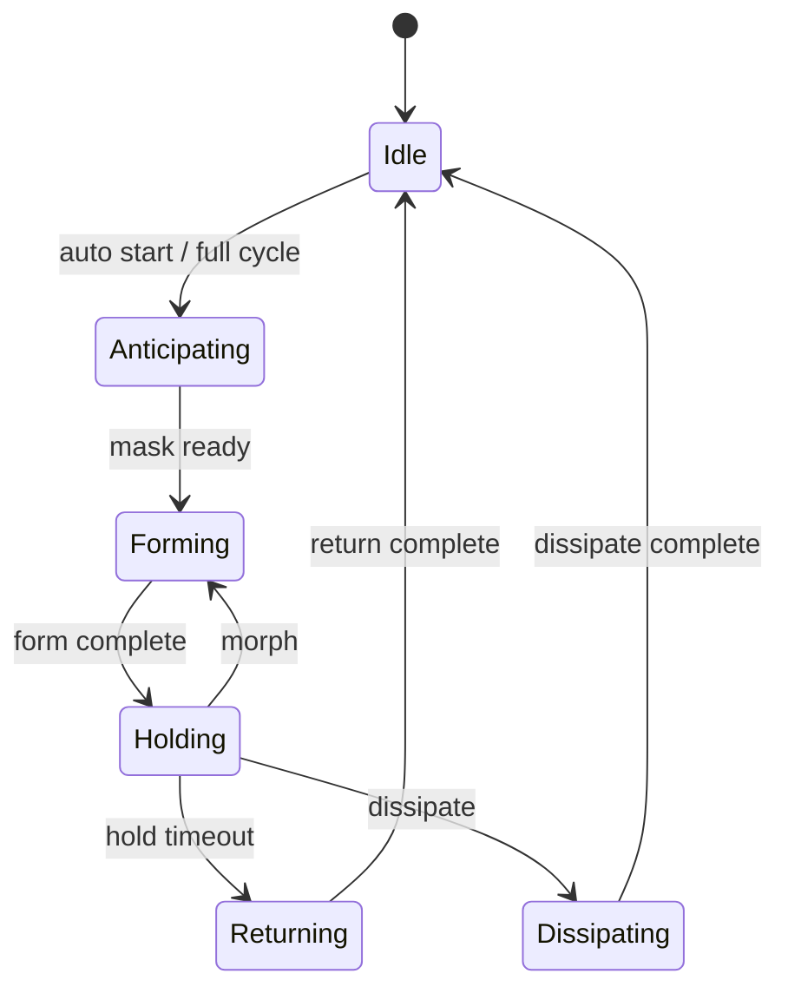
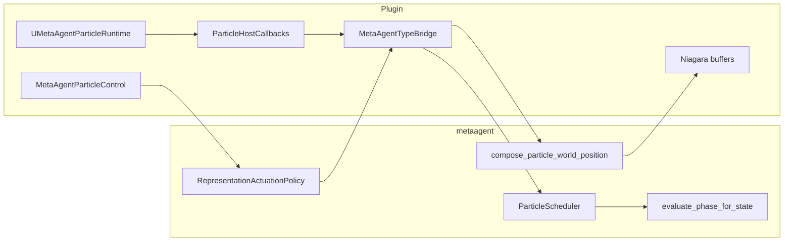

# MetaAgentPlugin

Under heavy development.

UE5 plugin for a multimodal MetaAgent runtime (character, camera, GUI, networking, recording, AI wander, particle orchestration). Modules: **MetaAgentPlugin** (runtime), **MetaAgentPluginEditor** (editor).

Portable domain logic lives in [`metaagent/`](./metaagent/) and is embedded into the plugin. See [`metaagent/README.md`](./metaagent/README.md) and [`metaagent/ARCHITECTURE.md`](./metaagent/ARCHITECTURE.md) for the core/host split.

---

## What is in `metaagent` vs the UE plugin?

| Concern | Portable (`metaagent/`) | UE host only |
|---------|-------------------------|--------------|
| Particle FSM, actuation, solvers | Yes | Niagara I/O, orchestrator, assets |
| Camera orbit / zoom / sway math | Yes | View target blend, focus queries, observation lock |
| Inbound HTTP `/health` `/echo` `/notify` | Yes (handlers) | Epic HTTPServer bind (`Host/MetaAgentHttpBridge`) |
| Outbound platform HTTP (H/G COMMS) | **`net/platform_client`** (URL, JSON, response parse) | **`FMetaAgentPlatformBridge`** (`FHttpModule` POST only) |
| Command + GUI validation | Yes (`app/commands`, `app/gui_catalog`, `app/gui_actions`) | Key binds, HUD draw, dispatch |
| Input policy (GUI open vs observation) | Yes | Enhanced Input, `PlayerTick` mouse hit-test |
| **Displayed particle pose / GPU apply** | `DisplayedPose`, `freeze_displayed_pose()`, continuity on transitions | `ParticleHostCallbacks`: read/apply + Niagara drivers |
| AI autopilot, recording, character pawn | `HostServiceCallbacks` + GUI catalog rows | `MetaAgentHostServicesBridge`, gameplay, player controller |

Deep dive: [`metaagent/ARCHITECTURE.md`](./metaagent/ARCHITECTURE.md) — **visual continuity** (`DisplayedPose`, `ParticleHostCallbacks`, continuity tests).

---

## Runtime overview



Default play mode today: **particle observation** — cinematic camera focused on particles, movement/mouse look disabled until you open the controls panel (**Q**). Mouse wheel zooms orbit distance when the panel is closed.

---

## Source layout

Runtime sources under `Source/MetaAgentPlugin/`:

| Path | Role |
|------|------|
| `MetaAgentPlugin.h/.cpp` | Module startup, settings, Blueprint library, outbound HTTP helper |
| `MetaAgentGameplay.h/.cpp` | Game mode, character, AI, game instance, HUD draw, camera sequences, **outbound COMMS** |
| `MetaAgentHUD.h` | HUD / GUI panel types |
| `MetaAgentPlayerController.h/.cpp` | Input, camera host state, GUI dispatch, recording, particles |
| `MetaAgentParticle*.h/.cpp` | Orchestrator, runtime, shapes, types |
| `MetaAgentTypeBridge.h/.cpp` | UE ↔ core conversion, scheduler + camera sync |
| `MetaAgentCoreAggregate.cpp` | Embeds `metaagent/metaagent.cpp` |
| `Host/MetaAgentHttpBridge.*` | Inbound HTTP server bridge |
| `Host/MetaAgentPlatformBridge.*` | Outbound platform POST bridge |
| `Host/MetaAgentHostSession.*` | Session snapshot for core validation |
| `Host/MetaAgentInputBridge.*` | Command / GUI validation wrapper |
| `Host/MetaAgentHostServicesBridge.*` | Recording + AI `HostServiceCallbacks` → player controller |

Editor: `Source/MetaAgentPluginEditor/`.

---

## Module 1 — CharacterRuntime

- Default pawn spawn/possess via `AMetaAgentGameMode`
- Character input is **off** in default observation mode (enable via modular runtime START or future panel section)
- **Implemented in:** `MetaAgentGameplay.h/.cpp`, `MetaAgentPlayerController.cpp`

---

## Module 2 — CameraRuntime

Observation cinematic camera with particle focus.

| Layer | What |
|-------|------|
| **Core** | `metaagent::camera::CameraController`, `compute_cinematic_pose`, `apply_orbit_radius_zoom` |
| **UE** | `FMetaAgentCameraRuntime`, view-target blend, `TryLockParticleFocusTarget`, startup auto-focus |

### Controls

| Input | Action |
|-------|--------|
| **O** | Toggle cinematic mode |
| **P** | Re-focus on particles |
| **V** | Cycle cinematic style (Oscillating hold ↔ Slow orbit) |
| **Wheel** | Zoom orbit radius (panel closed, cinematic on) |

### Config (UE)

Edit on `AMetaAgentPlayerController` → **Camera \| Cinematic** (`FMetaAgentCinematicCameraState`): pan duration, orbit radius, sway, oscillation amplitude, blend times, etc. Values sync to core `CinematicSettings` / `CinematicRuntimeState` each tick via `MetaAgentTypeBridge`.

Observation tuning: `ParticleObservationPaddingScale`, `ParticleObservationMinOrbitRadius` on the player controller.

### Adding camera styles / states

1. Add `CinematicStyle` + motion in `metaagent/src/camera/rig.cpp`.
2. Add matching `EMetaAgentCinematicCameraStyle` and TypeBridge enum mapping.
3. Optionally wire a command in `metaagent/app/commands` and a GUI panel row.

Focus resolution (where to look) stays in UE: `FMetaAgentCameraRuntime::ResolveFocusTarget`.

---

## Module 3 — GUIRuntime

Press **Q** to toggle the controls panel. Click rows or use keyboard shortcuts.

**Panel sections** come from core `build_gui_panel_catalog()`; UE only renders and dispatches.

| Section | Actions |
|---------|---------|
| GUI | Q — toggle panel; Esc — quit |
| Camera | O — cinematic; P — particle focus; **V — cycle style** |
| Networking | **H — start audio**; **G — start image** (requires Networking START) |
| Particle | F — load preview; `,` / `.` — step pattern; B / N — Slow / Dramatic presets |
| AI | **I — toggle autopilot** (requires AI START) |
| Recording | **J — start/stop capture**; **U — report status** (requires Recording START) |

Section headers support **START/STOP** toggles for Camera, Networking, Particle, AI, and Recording runtimes. Expand/collapse via the `>` / `v` control.

Dispatch: `FMetaAgentGUIRuntime::DispatchPanelAction` → validates via core (`MetaAgentInputBridge`) → host handlers. Particle rows use `ExecuteGuiParticleAction` (`particle/effect_catalog` lookup). AI and Recording rows use `FMetaAgentHostServicesBridge` → `invoke_toggle_autopilot` / `invoke_toggle_recording`.

Keyboard shortcuts for morph, cycle modes, snappy/dreamy presets, and legacy binds still exist where bound; panel rows mirror the primary shortcuts above.

- **Implemented in:** `MetaAgentHUD.h`, `MetaAgentGameplay.cpp` (draw/hit-test), `MetaAgentPlayerController.cpp`

---

## Module 4 — NetworkingRuntime

Two separate paths:

| Path | Core | UE host |
|------|------|---------|
| **Inbound** local HTTP server | `net/handlers`, `net/router` | `FMetaAgentHttpBridge` |
| **Outbound** platform events (H/G keys + panel) | `net/platform_client` | `FMetaAgentPlatformBridge` → `UMetaAgentGameInstance` status tracking |

Settings: `UMetaAgentPluginSettings` / game instance config (base URL, endpoint, session id).

- **Implemented in:** `MetaAgentGameplay.h/.cpp`, `Host/MetaAgentHttpBridge.*`, `Host/MetaAgentPlatformBridge.*`

---

## Module 5 — RecordingRuntime

Viewport capture via Movie Scene Capture (**J** toggle, **U** status). Core defines `HostServiceCallbacks` (toggle + query); UE wires them through `FMetaAgentHostServicesBridge` and public `ToggleRecordingFromGUI()` / `ReportRecordingStatusFromGUI()`.

Panel section **Recording Runtime** (enable via START) shows capture state, resolution, FPS, and output path.

- **Implemented in:** `MetaAgentPlayerController.cpp`, `Host/MetaAgentHostServicesBridge.*`, `MetaAgentGameplay.cpp`

---

## Module 6 — AIRuntime

Autopilot toggle (**I**). Core `HostServiceCallbacks::toggle_autopilot` and `query_ai` are wired via `FMetaAgentHostServicesBridge` → `ToggleAutopilotFromGUI()`.

Panel section **AI Runtime** (enable via START) shows autopilot state and configured controller class.

- **Implemented in:** `MetaAgentGameplay.h/.cpp`, `MetaAgentPlayerController.cpp`, `Host/MetaAgentHostServicesBridge.*`

---

## Module 7 — Particle orchestrator + runtime

### Roles

- **`UMetaAgentParticleOrchestrator`** — capture, preview texture, pattern config, `TriggerEffect(FName)`
- **`UMetaAgentParticleRuntime`** — scheduler tick; builds representation frame and applies actuation
- **`AMetaAgentPlayerController`** — input host, Niagara export callbacks, GUI particle actions

FSM and actuation math run in core `ParticleScheduler` (no duplicate graph in the plugin).

### Manual step flow (`.` key)

When stepping with **`.`**, the pattern uses a **silent Preparing** state while the image mask loads (no anticipating motion). Preparing should look like Idle. Continuity is handled in core via **`DisplayedPose`** and **`apply_visual_continuity_for_transition()`**, with the host supplying the on-screen pose through **`ParticleHostCallbacks::read_displayed_positions`**.



Auto full-cycle (play reveal) still uses **Anticipating** while the mask loads — see architecture doc.

### Controls

| Input | Action |
|-------|--------|
| **F** | Load `sdxl_latest.png` preview + shape source |
| **,** / **.** | Step pattern backward / forward |
| **B** / **N** | Slow / Dramatic preset |
| **Z** / **X** | Toggle radial cohesion / turbulent wake overlays (slow ambient breathing is always on) |
| **J** / **K** | Snappy / Dreamy preset (keyboard only; J also bound to recording toggle) |
| **M**, **T**, **Y**, **U** | Morph, cycle sampling/forming/returning (keyboard only) |

GUI panel rows mirror the core particle effect catalog (same as keyboard **F**, **,**, **.**, **B**, **N**).

Console: `MetaAgent.Pattern.*` (Form, Hold, Return, Preset, Status, Shape, ScatterGrid, Cancel, …).

### Pattern state machine (auto / legacy diagram)



### Portable vs UE (particles)



Host seam: `read_displayed_positions` returns `LastApplied` (compose + state effects); `apply_world_positions` updates runtime buffers after core freeze. Duplicate hold logic was removed from `BeginPatternStart` / `EnterPatternState`.

### Implemented in

- `MetaAgentParticleControl.h/.cpp` — orchestrator, drivers, Niagara profiles
- `MetaAgentParticleRuntime.h/.cpp` — runtime tick, buffer I/O
- `MetaAgentParticleShapes.h/.cpp` — PNG, mask cache, providers
- `MetaAgentTypeBridge.h/.cpp` — scheduler bridge
- `MetaAgentPlayerController.cpp` — input router, `ExecuteGuiParticleAction`

### Assets & Niagara

- Pattern data asset: `MetaAgentParticlePattern` (see `Config/DefaultGame.ini`)
- Niagara User params: `Content/MetaAgent/Niagara/PARAMETERS.md`

---

## Hardening direction (plugin vs core)

See [`metaagent/ARCHITECTURE.md`](./metaagent/ARCHITECTURE.md) for the full phase table.

| Module | Role |
|--------|------|
| `app/gui_catalog` | Panel sections + action IDs (UE renders catalog only) |
| `particle/effect_catalog` | GUI particle actions → effect IDs / load-preview dispatch |
| `runtime/host_interfaces` | Recording + AI + **ParticleHostCallbacks** |
| `particle/visual_continuity` | `DisplayedPose`, `freeze_displayed_pose()`, per-edge continuity |
| `tools/metaagent_server` | Standalone inbound HTTP CLI (no editor) |

### Recommended next steps

| Priority | Work | Why |
|----------|------|-----|
| **P1** | **`authoritative_particle_count` in `PatternRuntime`** | Single core count for mask builds and capture rejection (host still supplies via callback) |
| **P2** | Headless particle sim test harness (no Niagara) | CI regression for full FSM + continuity with mocked host callbacks |
| **P2** | Extend `/health` session snapshot with particle FSM summary | Better observability for automation |
| **P3** | Code-generated HUD rows from catalog metadata | Reduce UE dispatch boilerplate when adding actions |

Completed (2026-06): core `DisplayedPose` + `freeze_displayed_pose()` + `visual_continuity_test`; `ParticleHostCallbacks` on scheduler; UE host read/apply only; `HostServiceCallbacks` + AI/Recording GUI rows.

---

## Build

Default dev loop (core + tests + UE plugin):

```powershell
# From repo root — no args runs full dev compile
.\dev.bat

# Same as above
.\dev.bat dev
```

Other targets:

```powershell
.\dev.bat core      # metaagent CMake build only
.\dev.bat test      # metaagent unit tests
.\dev.bat plugin    # UE plugin only
.\dev.bat build     # full game + editor target
.\dev.bat launch    # open Unreal Editor
.\dev.bat all       # dev + launch editor
```

Close the Unreal Editor before building if Live Coding blocks compilation.

Standalone `metaagent_server` (after `.\dev.bat core`):

```powershell
.\metaagent\build\metaagent_server.exe --port 8080
```

---

## License

Licensed under the [MIT License](./LICENSE).
