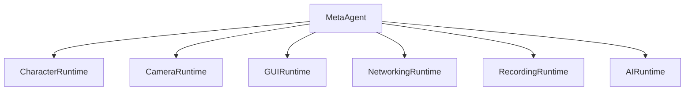

# MetaAgentPlugin

Under heavy development. 

- UE5 plugin with several runtimes for humanoid agents.
- Modules: MetaAgentPlugin (Runtime), MetaAgentPluginEditor (Editor).

Objective: Allow an active agent to control the cinematic area. This plugin creates new levels and has default BPs to use. 

## Flowchart

## Modules

### Module 1 : MetaAgentCharacterRuntime

- Default pawn spawn and possession via game mode
- Blueprint-owned camera/mesh/animation setup
- Minimal runtime bootstrap (no recovery pipeline)
- Implemented in:
	- `Systems/CharacterRuntime/MetaAgentCharacterRuntime.h`
	- `Systems/CharacterRuntime/MetaAgentCharacterRuntime.cpp`

Module 1: simplified runtime flow

1. Resolve `DefaultPlayerPawnClass` from `MetaAgentGameMode` config.
2. Spawn and possess the default pawn through standard `AGameModeBase::RestartPlayer`.
3. Keep CharacterRuntime bootstrap minimal (no mesh/anim recovery pipeline).
4. Let `BP_MH_PlayerChar` own camera, mesh, and animation setup directly.

### Module 2: MetaAgentCameraRuntime (Environment Viewer)

- Environment-only camera system for pure scene exploration
- Free-look with mouse and keyboard movement
- Mouse wheel zoom for distance control
- Cinematic orbital camera mode (`O`)
- Simplified for viewer-only without character dependencies
- Implemented in:
	- `Systems/CameraRuntime/MetaAgentCameraRuntime.h`
	- `Systems/CameraRuntime/MetaAgentCameraRuntime.cpp`

Module 2: Simplified runtime steps (environment viewing only)

1. Keep `AMetaAgentPlayerController` as the input owner for camera actions.
2. Route all camera execution through `FMetaAgentCameraRuntime` sequences.
3. Keep `FMetaAgentCameraZoomState` in the controller for zoom interpolation and bounds.
4. Consume discrete mouse-wheel up/down zoom input (step in/out).
5. Consume analog wheel-axis zoom input for smooth zooming.
6. Interpolate camera zoom distance toward desired distance.
7. Clamp zoom distances to configured min/max bounds (40–1500 units).
8. Clamp and sanitize zoom tuning values before runtime use.
9. Route `O` toggle handling through runtime cinematic-toggle sequence.
10. Enable cinematic mode through runtime camera-activation sequence (smooth orbital motion).
11. Disable cinematic mode through runtime camera-teardown sequence (restore free-look).
12. Update cinematic camera every frame through runtime update sequence.
13. Spawn a transient runtime `ACameraActor` when cinematic mode starts.
14. Reuse existing runtime cinematic camera actor when still valid.
15. Rebuild runtime cinematic camera actor when stale or world-mismatched.
16. Preserve pre-cinematic view state for deterministic restore on exit.
17. Restore view to free-look mode on cinematic exit.
18. Keep player input fully enabled during all camera modes (free exploration).
19. Apply oscillating-hold cinematic motion style (smooth sway around focus point).
20. Apply runtime sway and look-at behavior for cinematic framing.
21. Auto-disable cinematic mode when runtime camera prerequisites are lost.
22. Keep the runtime camera module extensible for additional orbital styles.

### Module 3: MetaAgentGUIRuntime

- Runtime GUI panel orchestration owned by a dedicated module
- HUD help panel visibility toggle bound to keyboard (`Q`)
- Keyboard-function reference panel rendered when GUI help is active
- Implemented in:
	- `Systems/GUIRuntime/MetaAgentGUIRuntime.h`
	- `Systems/GUIRuntime/MetaAgentGUIRuntime.cpp`
	- `Systems/GUIRuntime/MetaAgentPlayerControllerGUI.cpp`

Module 3: 20 sequential runtime steps

1. Keep `AMetaAgentPlayerController` as input owner for GUI toggle actions.
2. Route GUI panel behavior through `FMetaAgentGUIRuntime` sequences.
3. Keep `FMetaAgentGUIState` in the controller as runtime GUI state storage.
4. Bind `Q` key in controller utility input setup for help panel toggling.
5. Handle `Q` key press through a dedicated controller-to-runtime bridge.
6. Initialize default keyboard-help lines on first GUI runtime application.
7. Keep help panel lines cached in runtime GUI state for deterministic redraw.
8. Apply GUI runtime state to HUD through explicit runtime apply sequence.
9. Push canonical help lines from GUI runtime to HUD each apply cycle.
10. Push help-panel visibility flag from GUI runtime to HUD each apply cycle.
11. Toggle help-panel visibility state in runtime sequence on each `Q` press.
12. Emit runtime log entries when help panel visibility changes.
13. Keep GUI toggle behavior free of transient keypress popup text.
14. Render help panel title and key-function rows via HUD canvas drawing.
15. Include active runtime key rows for recording (`J`/`U`) and COMMS (`H`/`G`).
16. Include fallback movement and look controls (`W/A/S/D`, `Shift`, mouse, wheel).
17. Keep help panel render path independent from status panel availability.
18. Keep recording status integrated into the main help panel with a separator row.
19. Preserve existing camera, autopilot, and recording runtime behavior unchanged.
20. Keep GUI runtime extensible for future panel types beyond controls help.

### Module 4: MetaAgentNetworkingRuntime

- Runtime networking orchestration through `UMetaAgentGameInstance`
- Embedded HTTP server for editor, standalone, and packaged runtime builds
- Runtime outbound platform event forwarding and inbound notify handling
- Bottom-left Networking Runtime GUI panel shown when GUI (`Q`) is active
- Implemented in:
	- `Systems/NetworkingRuntime/MetaAgentGameInstanceNetworking.cpp`
	- `Systems/NetworkingRuntime/MetaAgentGameInstance.h`
	- `Systems/NetworkingRuntime/MetaAgentGameInstance.cpp`

Module 4: 20 sequential runtime steps

1. Keep `UMetaAgentGameInstance` as the runtime networking owner.
2. Initialize NetworkingRuntime snapshot state during game instance startup.
3. Start local HTTP server during runtime init when networking is enabled.
4. Embed server behavior in editor, standalone, and packaged runtime builds.
5. Bind `/health` endpoint for runtime health checks.
6. Bind `/echo` endpoint for payload round-trip checks.
7. Bind `/notify` endpoint for external notifications.
8. Start listeners after routes are bound.
9. Track router/listener state in runtime snapshot fields.
10. Expose runtime server status through `GetLocalHttpServerStatusText`.
11. Build platform forwarding URL from configured base and endpoint.
12. Send outbound platform events with runtime metadata payload.
13. Track last event name, send time, receive time, and result status.
14. Track HTTP/network errors in runtime snapshot fields.
15. Parse platform response payload for agent action/running state.
16. Track latest notify message from `/notify` requests.
17. Stop server and unbind routes during game instance shutdown.
18. Expose formatted NetworkingRuntime panel lines to GUI runtime.
19. Draw bottom-left networking rectangle only while GUI panel is active.
20. Keep networking runtime extensible for future endpoint families.

### Module 5: MetaAgentRecordingRuntime

- Simple runtime recording based on direct HiRes frame capture (no Take Recorder dependency)
- `J` toggles capture start/stop and writes PNG frames directly to disk
- Frames are captured from the active player camera at fixed FPS
- Output directory is created under `Saved/Renders/HiResFrames_YYYYMMDD_HHMMSS`
- `U` reports output/capture status (frames are already saved on disk)
- Recording panel shows runtime capture state, resolution, frame count, and output path

Module 5: 12 sequential runtime steps

1. Press `J` to start frame capture.
2. Initialize a new output folder in `Saved/Renders`.
3. Mark runtime recording active and reset counters.
4. Tick capture accumulator every frame.
5. Capture at configured fixed FPS (default 15 FPS).
6. For each capture step, request a HiRes screenshot using configured resolution.
7. Save frames as sequential PNG files (`frame_000000.png`, ...).
8. Update recording runtime panel line values continuously.
9. Press `J` again to stop capture.
10. Keep all captured frames in the output directory.
11. Press `U` to report save/status summary for the current or last capture session.
12. Use output frames directly for post-processing or external encoding.

### Module 6: MetaAgentAIRuntime

- Runtime AI wander controller (`AMetaAgentWanderAIController`) builds and runs a behavior tree in code.
- Autopilot toggle logic (`AMetaAgentPlayerController`) now lives in AIRuntime and hands possession to AI.
- Autopilot runtime toggle key is `I`.
- AI behavior is simple patrol wandering:
	- pick random patrol point in radius
	- move to patrol point
	- wait for random interval
	- repeat
- Implemented in:
	- `Systems/AIRuntime/MetaAgentWanderAIController.cpp`
	- `Systems/AIRuntime/MetaAgentPlayerControllerAutopilot.cpp`

Module 6: 10 sequential runtime steps

1. Player presses `I` to toggle autopilot.
2. Debounce guards prevent rapid toggle spam.
3. Controller caches currently possessed pawn.
4. Controller spawns runtime AI controller (`AMetaAgentWanderAIController` by default).
5. Player controller unpossesses pawn.
6. AI controller possesses pawn and starts runtime behavior tree.
7. Runtime behavior tree sets a random patrol location.
8. AI moves to location, then waits random interval.
9. Loop repeats for continuous roaming.
10. Press `I` again to unpossess AI, destroy it, and restore player possession.

## License

Licensed under the [MIT License](./LICENSE).