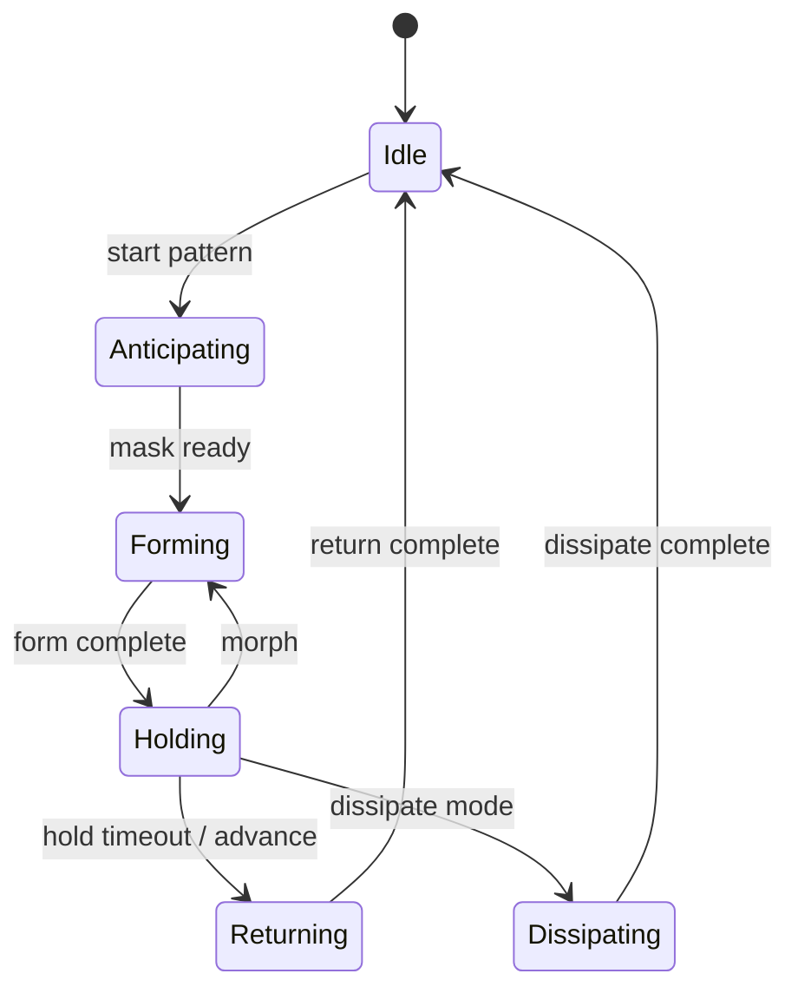
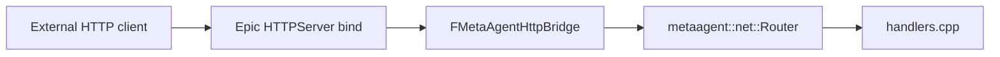
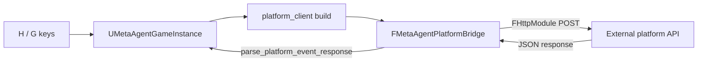

# metaagent — Architecture

Portable C++17 library for MetaAgent **domain logic**: particle pattern mechanics, camera rig math, media/mask pipeline, HTTP route handlers, session snapshots, command validation, and input policy. Unreal (or another host) supplies I/O, rendering, and engine APIs through thin bridges.

---

## Design goals

| Goal | How |
|------|-----|
| Portability | C++17, `metaagent::core::*` value types (no `FVector` / `FString`) |
| Single source of truth | FSM, solvers, phase curves, actuation compose, scheduler, shape/mask algorithms, camera pose math, HTTP handler bodies |
| Testability | CMake + unit tests without the editor |
| Engine bridge | Host converts types and supplies I/O callbacks (Niagara, PNG, world queries, HTTPServer bind, view-target blend) |

---

## Repository layout

```
metaagent/
├── metaagent.h                    Umbrella public API
├── metaagent.cpp                  Single TU — #includes all module .cpp files
├── include/metaagent/
│   ├── initialize.hpp             initialize_defaults()
│   ├── core/                      Vec3, math, log_sink
│   ├── media/                     PNG/JPEG decode, MediaStore, mask pipeline
│   ├── camera/                    Zoom + cinematic rig/controller
│   ├── particle/                  Pattern domain
│   ├── net/                       Route table, JSON, /health /echo /notify handlers
│   ├── notify/                    Notify body parsing
│   ├── session/                   RuntimeSession + status strings
│   ├── app/                       Command registry, GUI catalog, action validation
│   ├── runtime/                   Host service callbacks (recording, AI snapshots)
│   └── input/                     Input policy (GUI vs gameplay)
├── tools/
│   ├── metaagent_server.cpp       Standalone inbound HTTP CLI
│   └── mini_http_server.cpp       Minimal TCP HTTP server
├── tests/
├── CMakeLists.txt
├── README.md
└── ARCHITECTURE.md
```

Public entry point: `#include <metaagent/metaagent.h>`.

---

## What lives in core vs the UE host

| Area | In `metaagent` (portable) | Stays in UE plugin (host) |
|------|---------------------------|---------------------------|
| **Particles** | FSM, scheduler, actuation, solvers, shape/mask | Niagara buffers, orchestrator UX, UObject runtime |
| **Camera** | Orbit pose, sway, zoom, `CameraController` state machine | `SetViewTargetWithBlend`, player camera manager, particle/world focus queries, locked observation frame |
| **HTTP inbound** | `/health`, `/echo`, `/notify` handlers + router | Epic `HTTPServer` bind/listen (`FMetaAgentHttpBridge`) |
| **HTTP outbound** | URL/body build + response parse (`net/platform_client`) | Async POST transport (`FMetaAgentPlatformBridge` + `FHttpModule`) |
| **Session / commands** | `RuntimeSession`, `validate_command`, `validate_gui_action` | `MetaAgentHostSession`, `MetaAgentInputBridge` snapshot build |
| **Input policy** | `policy_for_runtime()` (GUI clicks vs wheel-only gameplay) | Key binds, Enhanced Input, `PlayerTick` GUI hit-test |
| **GUI panel** | `gui_catalog`, action validation, command IDs | HUD draw, click regions, host dispatch only |

**Rule of thumb:** if it touches Epic APIs, Niagara, the viewport, or the filesystem at runtime, it stays in the host. If it is pure state + math + JSON + validation, it belongs in core.

---

## Module map

### Media (`metaagent/media/`)

| Module | Role |
|--------|------|
| `decode` | PNG/JPEG via stb_image (file + memory) |
| `store` | Load/cache images by path identity |
| `pipeline` | Mask build + preview thumbnails |
| `mask_cache` | Sync mask result cache |

### Camera (`metaagent/camera/`)

| Module | Role |
|--------|------|
| `types` | `ZoomSettings`, `CinematicSettings`, `CinematicRuntimeState`, `FocusTarget`, `CinematicStyle` |
| `rig` | `compute_cinematic_pose`, `apply_orbit_radius_zoom`, `apply_zoom_input`, focus-from-bounds |
| `controller` | Per-session `CameraController`: enable/disable cinematic, tick pose, zoom |

**Camera state model (core):**

- **Settings** (`CinematicSettings`) — designer/config fields: pan duration, orbit radius floor, sway amplitudes/frequency, `active_style`.
- **Runtime** (`CinematicRuntimeState`) — simulation state: `mode_enabled`, elapsed time, orbit radius, height offset, yaw phase.
| **Style** (`CinematicStyle`) — `OscillatingHold` (sway + hold) and `SlowOrbit` (continuous yaw orbit, no sway). Cycle via **V** or panel row `CycleCinematicStyle`.

UE mirrors settings in `FMetaAgentCinematicCameraState` and syncs through `MetaAgentTypeBridge::sync_cinematic_*`. Each tick, `FMetaAgentCameraRuntime::RunUpdateCinematicCameraSequence` calls `CameraController::tick_cinematic()` and applies the returned `CameraPose` to the view target.

**Adding a new camera style / movement state:**

1. Add a value to `CinematicStyle` in `camera/types.hpp`.
2. Implement motion in `compute_cinematic_pose()` (`camera/rig.cpp`) — switch on `active_style`.
3. Add a matching `EMetaAgentCinematicCameraStyle` in `MetaAgentPlayerController.h`.
4. Map enum both ways in `MetaAgentTypeBridge.cpp` (`SyncCinematicSettingsToCore`).
5. Optionally expose toggles via `metaagent/app/commands` + GUI action IDs + panel rows.

Focus resolution (particle bounds, locked observation target) remains host-side in `FMetaAgentCameraRuntime::ResolveFocusTarget`.

### App / session / net / input

| Module | Role |
|--------|------|
| `session/types` | `RuntimeSession`, `FeatureFlags` (input, camera, particle, ui, networking, …) |
| `session/status` | Status line builders for HUD / HTTP |
| `app/commands` | `CommandId`, parse + validate (pattern step, cinematic, focus, GUI, preview load, **StartAudio/StartImage**, **CycleCinematicStyle**) |
| `app/gui_catalog` | Panel sections, rows, action IDs — single source for HUD catalog |
| `app/gui_actions` | Map GUI action string IDs → commands |
| `input/policy` | Block move/look/buttons in observation mode; allow wheel zoom when GUI closed |
| `net/router` | Route table dispatch |
| `net/handlers` | `/health`, `/echo`, `/notify` |
| `notify/parse` | Parse notify POST bodies |

### Particle domain (`metaagent/particle/`)

| Module | Key API | Role |
|--------|---------|------|
| `pattern_types` | `PatternConfig`, `PatternRuntime` | FSM state, buffers, curve samples |
| `transition_graph` | `TransitionGraph` | FSM table (scheduler-internal) |
| `scheduler` | `ParticleScheduler`, `SchedulerCallbacks` | Tick, transitions, representation frame |
| `forming_solver` | `FormingSolverRegistry` | Per-particle forming / return motion |
| `actuation_math` | `ActuationMath` | Phase evaluation, position composition |
| `representation_actuation` | `RepresentationActuationPolicy` | Direct / Parameters / Hybrid delivery |
| `shape_builder` | `ShapeBuilder` | Targets, frames, silhouette assignment |
| `image_mask_processor` | `image_mask::build_mask_from_rgba` | Mask + stratified scatter |
| `effect_catalog` | `find_particle_gui_action`, `particle_gui_panel_rows` | GUI particle action specs (load preview vs trigger effect ID) |

---

## Pattern FSM

States: `Idle`, `Preparing`, `Anticipating`, `Forming`, `Holding`, `Returning`, `Dissipating`, `Releasing`.

The scheduler advances via `TransitionGraph::evaluate_transition()`. UE calls through `MetaAgentParticleCoreBridge` — **no parallel FSM table in the plugin**.



---

## UE plugin split

| Plugin path | Role |
|-------------|------|
| `MetaAgentCoreAggregate.cpp` | Embeds `metaagent/metaagent.cpp` |
| `MetaAgentTypeBridge.*` | UE ↔ core conversion, scheduler bridge, camera sync |
| `MetaAgentParticleRuntime.*` | UObject instance, Niagara tick glue |
| `MetaAgentParticleControl.*` | Orchestrator, drivers, Niagara profiles |
| `MetaAgentParticleShapes.*` | PNG load, mask cache, shape providers |
| `MetaAgentPlayerController.*` | Input, camera host sequences, GUI dispatch entry |
| `MetaAgentGameplay.*` | Game mode, character, AI, **outbound HTTP client** |
| `Host/MetaAgentHttpBridge.*` | Epic HTTPServer → core router |
| `Host/MetaAgentPlatformBridge.*` | Outbound platform POST via `FHttpModule` |
| `Host/MetaAgentHostSession.*` | Live session snapshot for validation + `/health` |
| `Host/MetaAgentInputBridge.*` | Command / GUI validation wrapper |
| `MetaAgentHUD.h` + HUD draw in `MetaAgentGameplay.cpp` | Panel types + canvas hit regions |

---

## HTTP flow



### Outbound platform POST



Core owns URL join, JSON payload, and response parsing. UE owns async HTTP transport only.

---

## Hardening roadmap (core vs host)

| Phase | Goal | Status |
|-------|------|--------|
| A | Particle FSM + actuation in core | Done |
| B | Inbound HTTP handlers + session/commands in core | Done |
| C | Host bridges (`HttpBridge`, `HostSession`, `InputBridge`) | Done |
| D | Outbound platform client + `PlatformBridge` | Done |
| E | GUI panel catalog + dispatch validation in core | Done |
| F | Camera style registry (`SlowOrbit`); focus bounds in core | Done (focus query still host) |
| G | Particle effect catalog in core | Done |
| H | Standalone `metaagent_server` CLI | Done |
| I | Recording / AI behind core interfaces (`runtime/host_interfaces`) | Done (UE wiring optional) |

**Next high-value moves:** wire `HostServiceCallbacks` from UE for recording/AI; expose Recording/AI panel sections via `gui_catalog` when ready.

---

## Build

### Standalone

```powershell
cd metaagent
cmake -S . -B build -DCMAKE_BUILD_TYPE=Release
cmake --build build
ctest --test-dir build --output-on-failure
```

Tests include: `transition_graph_test`, `forming_types_test`, `shape_builder_polyline_test`, `actuation_composer_test`, `media_decode_test`, `camera_rig_test`, `net_handler_test`, `app_command_test`, `gui_actions_test`, `platform_client_test`, `gui_catalog_test`, `effect_catalog_test`, `host_interfaces_test`.

### Standalone HTTP server

```powershell
cmake --build build --target metaagent_server
./build/metaagent_server.exe --port 8080
```

Serves core inbound routes (`/health`, `/echo`, `/notify`) without Unreal.

### Unreal

`MetaAgentCoreAggregate.cpp` includes portable sources; `MetaAgentPlugin.Build.cs` adds `metaagent/include`.

---

## Extension points

1. **New forming mode** — solver in `forming_solver.cpp`, register in `initialize_defaults()`, mirror enum in TypeBridge.
2. **New shape source** — UE provider in shape registry; portable assignment in `shape_builder.cpp`.
3. **New camera style** — `CinematicStyle` + `compute_cinematic_pose` case + UE enum/sync (see Camera section above).
4. **New HTTP route** — handler in `net/handlers.cpp`, register in router; bind path unchanged in `MetaAgentHttpBridge`.
5. **New platform event** — build/parse via `net/platform_client`; transport stays in `FMetaAgentPlatformBridge`.
6. **New validated command** — `CommandId` + `validate_command` + host handler + optional GUI action ID.

Product usage and keyboard controls: repository root [`README.md`](../README.md).
