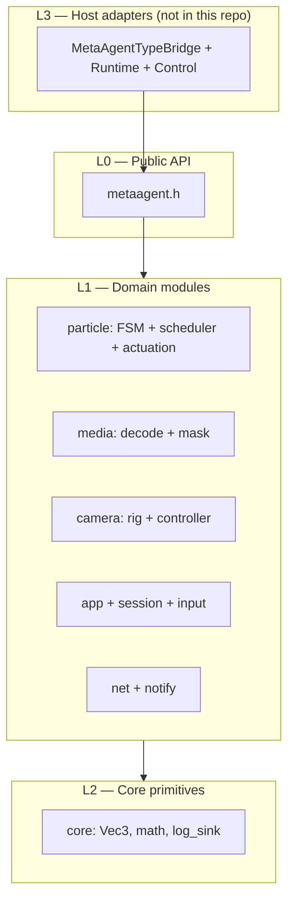
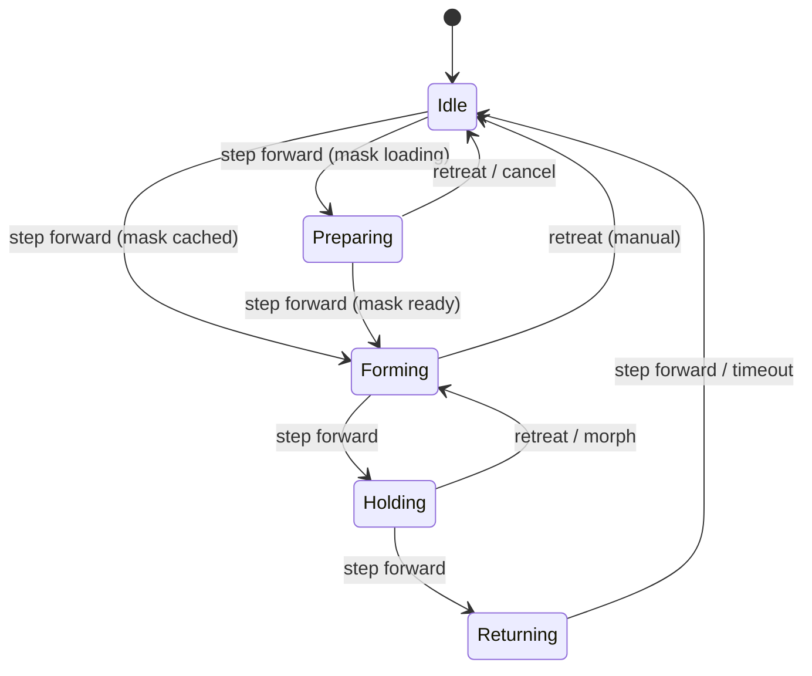
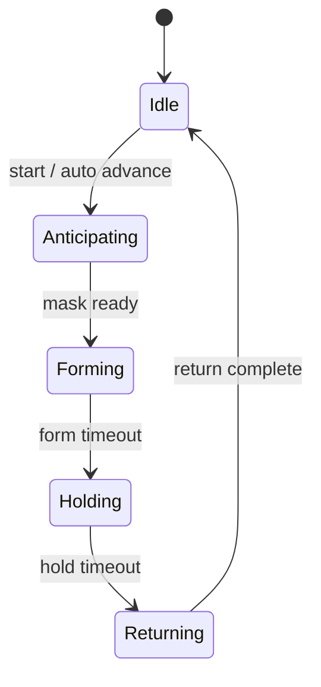
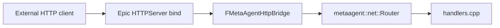

# metaagent — Architecture

Portable C++17 library for MetaAgent **domain logic**: particle pattern mechanics, camera rig math, media/mask pipeline, HTTP route handlers, session snapshots, command validation, and input policy. Unreal (or another host) supplies I/O, rendering, and engine APIs through thin bridges.

---

## Design goals

| Goal | How |
|------|-----|
| Portability | C++17, `metaagent::core::*` value types (no `FVector` / `FString`) |
| Single source of truth | FSM, solvers, phase curves, actuation compose, scheduler, shape/mask algorithms, camera pose math, HTTP handler bodies |
| Testability | CMake + unit tests without the editor |
| Engine bridge | Host converts types and supplies I/O callbacks (Niagara, PNG, world queries, HTTPServer bind, view-target blend) |

**Rule of thumb:** if it touches Epic APIs, Niagara, the viewport, or runtime filesystem I/O, it stays in the host. If it is pure state + math + JSON + validation, it belongs in core.

---

## Layer model



### What to abstract next (professional library seams)

| Seam | Today | Target |
|------|-------|--------|
| **Visual pose** | Split: core `compose` vs host `LastApplied` + state effects | Core `DisplayedPose` + `freeze_pose_for_transition()`; host only reads/writes GPU buffers |
| **Particle I/O** | UE direct capture + callback export + orchestrator | `runtime/ParticleHostCallbacks`: `capture()`, `apply()`, `displayed_count()` |
| **Shape / mask** | Core algorithms + UE async cache + PNG load | Core owns mask cache API; host supplies `load_rgba(path)` only |
| **Representation delivery** | Core `RepresentationActuationPolicy`; UE driver registry | Policy stays core; one `IRepresentationDriver` interface documented for other engines |
| **Commands / GUI** | Core catalog + validation; UE HUD draw | Already clean — add code-generated panel rows from catalog |
| **Session snapshot** | `RuntimeSession` + `HostSession` | Extend with particle FSM summary for HTTP `/health` |

---

## Repository layout

```
metaagent/
├── metaagent.h                    Umbrella public API
├── metaagent.cpp                  Single TU — #includes all module .cpp files
├── include/metaagent/
│   ├── initialize.hpp             initialize_defaults()
│   ├── core/                      Vec3, math, log_sink
│   ├── media/                     PNG/JPEG decode, MediaStore, mask pipeline
│   ├── camera/                    Zoom + cinematic rig/controller
│   ├── particle/                  Pattern domain (FSM, scheduler, actuation, shapes)
│   ├── net/                       Route table, handlers, platform_client
│   ├── notify/                    Notify body parsing
│   ├── session/                   RuntimeSession + status strings
│   ├── app/                       Command registry, GUI catalog, action validation
│   ├── runtime/                   Host service callbacks (recording, AI)
│   └── input/                     Input policy (GUI vs gameplay)
├── tools/
│   ├── metaagent_server.cpp       Standalone inbound HTTP CLI
│   └── mini_http_server.cpp       Minimal TCP HTTP server
├── tests/
├── CMakeLists.txt
├── README.md
└── ARCHITECTURE.md
```

Public entry point: `#include <metaagent/metaagent.h>`.

---

## What lives in core vs the UE host

| Area | In `metaagent` (portable) | Stays in UE plugin (host) |
|------|---------------------------|---------------------------|
| **Particles** | FSM, scheduler, actuation, solvers, shape/mask math, state effects | Niagara buffers, direct capture, orchestrator UX, UObject runtime |
| **Camera** | Orbit pose, sway, zoom, `CameraController` | `SetViewTargetWithBlend`, focus queries, observation lock |
| **HTTP inbound** | `/health`, `/echo`, `/notify` handlers + router | Epic `HTTPServer` bind/listen |
| **HTTP outbound** | URL/body build + response parse | Async POST transport (`FHttpModule`) |
| **Session / commands** | `RuntimeSession`, `validate_command`, `validate_gui_action` | Key binds, HUD draw, dispatch |
| **Input policy** | `policy_for_runtime()` | Enhanced Input, mouse hit-test |
| **GUI panel** | `gui_catalog`, action validation | Canvas draw, click regions |

---

## Particle domain (`metaagent/particle/`)

| Module | Key API | Role |
|--------|---------|------|
| `pattern_types` | `PatternConfig`, `PatternRuntime` | FSM state, buffers, curve samples |
| `transition_graph` | `TransitionGraph` | Declarative FSM table |
| `scheduler` | `ParticleScheduler`, `SchedulerCallbacks` | Tick, transitions, representation frame, **visual continuity capture** |
| `forming_solver` | `FormingSolverRegistry` | Per-particle forming / return motion |
| `actuation_math` | `ActuationMath` | Phase evaluation, position composition |
| `representation_actuation` | `RepresentationActuationPolicy` | Direct / Parameters / Hybrid delivery |
| `representation_types` | `RepresentationMapping` | Macro phase from pattern state |
| `shape_builder` | `ShapeBuilder` | Targets, frames, silhouette assignment |
| `image_mask_processor` | `image_mask::build_mask_from_rgba` | Mask + stratified scatter |
| `state_effects` | `StateEffectStack` | Ambient breathing + optional cohesion/turbulence |
| `effect_catalog` | GUI particle action specs | Load preview vs trigger effect ID |

### Pattern FSM

States: `Idle`, `Preparing`, `Anticipating`, `Forming`, `Holding`, `Returning`, `Dissipating`, `Releasing`.

The scheduler advances via `TransitionGraph::evaluate_transition()`. The UE plugin calls through `MetaAgentParticleCoreBridge` — **no parallel FSM table in the plugin**.

#### Manual step mode (`.` key) — current production flow

Silent mask wait; no anticipating noise. Preparing is visually identical to Idle (calm ambient).



#### Auto full-cycle mode (play full reveal)

Uses anticipating motion while the mask loads.



---

## Visual continuity and the Idle transition teleport

### Symptom

After leaving **Idle** (first step into **Preparing** or **Forming**), particles can **jump slightly** even when the FSM transition succeeds.

### Root cause (architectural)

Actuation is a **two-stage pipeline**:

1. **Core compose** — `ActuationMath::compose_world_positions()` blends baseline → targets using phase/state (no GPU).
2. **Host post-compose** — state-effect offsets (ambient breathing) are added in UE when building `LastAppliedWorldPositions`.

Continuity today is **split**:

| Layer | Mechanism |
|-------|-----------|
| Core | `capture_visual_continuity_for_transition()` — freezes **composed rest** (stage 1 only) |
| UE | `ResolveDisplayedParticlePositions()`, `ApplyDisplayedPoseHold()`, `DirectCaptureAuthoritativeCount` — tries to freeze **displayed** pose (stage 1 + 2) |

Additional host-only issues that caused regressions:

- Niagara callback exports can report **hundreds** of positions while direct capture sees **N** live particles → wrong mask builds and baseline drift.
- `BeginPatternStart` historically overwrote rest baseline with raw sim capture instead of displayed pose.
- **Preparing** used macro phase `Prepare` while **Idle** used `Idle` → Niagara driver parameter discontinuity.

Recent mitigations (UE + partial core):

- Authoritative particle count + baseline resync in `UMetaAgentParticleRuntime`.
- Preparing uses **Idle macro phase** and `pattern_active = false` in `build_representation_frame()`.
- Manual Idle→start: core capture + UE displayed-pose hold before entering Preparing.

### Target design (library-quality fix)

Move continuity into core as a **first-class concept**:

```cpp
// Proposed — particle/visual_continuity.hpp
struct DisplayedPose {
    core::Array<core::Vec3> world_positions;
    core::Vec3 pattern_center;
};

// Host callback: return what is actually on screen (after all offsets)
struct ParticleHostCallbacks {
    std::function<bool(DisplayedPose& out)> read_displayed_positions;
    std::function<void(const core::Array<core::Vec3>&)> apply_world_positions;
    std::function<int32_t()> authoritative_particle_count;
};

// Scheduler API
void freeze_displayed_pose(ParticleScheduler& scheduler, const DisplayedPose& displayed);
// Sets baseline == targets == displayed; preserves idle_baseline_world_positions for return
```

**Tests to add:** `visual_continuity_test.cpp` — for each transition edge, assert max position delta ≈ 0 when pose is frozen.

**Host responsibility after migration:** implement `read_displayed_positions` / `apply_world_positions` only; remove duplicate hold logic from `BeginPatternStart`.

---

## Camera (`metaagent/camera/`)

| Module | Role |
|--------|------|
| `types` | `ZoomSettings`, `CinematicSettings`, `CinematicRuntimeState`, `FocusTarget`, `CinematicStyle` |
| `rig` | `compute_cinematic_pose`, zoom, focus-from-bounds |
| `controller` | Per-session `CameraController`: enable/disable cinematic, tick pose, zoom |

Styles: `OscillatingHold` (sway + hold), `SlowOrbit` (continuous yaw). Cycle via **V** or GUI.

Focus resolution (particle bounds, locked observation target) remains host-side in `FMetaAgentCameraRuntime::ResolveFocusTarget`.

---

## App / session / net / input

| Module | Role |
|--------|------|
| `session/types` | `RuntimeSession`, `FeatureFlags` |
| `app/commands` | `CommandId`, parse + validate |
| `app/gui_catalog` | Panel sections, rows, action IDs |
| `app/gui_actions` | GUI action string IDs → commands |
| `input/policy` | Block move/look in observation mode; allow wheel zoom when GUI closed |
| `net/router` + `handlers` | `/health`, `/echo`, `/notify` |
| `net/platform_client` | Outbound platform POST build/parse |
| `runtime/host_interfaces` | Recording + AI snapshots and toggles |

---

## UE plugin split

| Plugin path | Role |
|-------------|------|
| `MetaAgentCoreAggregate.cpp` | Embeds `metaagent/metaagent.cpp` |
| `MetaAgentTypeBridge.*` | UE ↔ core conversion, scheduler bridge, camera sync |
| `MetaAgentParticleRuntime.*` | UObject instance, Niagara tick glue, **displayed pose cache** |
| `MetaAgentParticleControl.*` | Orchestrator, drivers, Niagara profiles |
| `MetaAgentParticleShapes.*` | PNG load, mask cache, shape providers |
| `MetaAgentPlayerController.*` | Input, camera host, GUI dispatch |
| `Host/MetaAgentHttpBridge.*` | Inbound HTTP |
| `Host/MetaAgentPlatformBridge.*` | Outbound HTTP |
| `Host/MetaAgentHostSession.*` | Session snapshot |
| `Host/MetaAgentInputBridge.*` | Command / GUI validation |

---

## HTTP flow



Outbound: core `platform_client` builds/parses; `FMetaAgentPlatformBridge` performs async POST.

---

## Roadmap

| Phase | Goal | Status |
|-------|------|--------|
| A | Particle FSM + actuation in core | Done |
| B | Inbound HTTP + session/commands in core | Done |
| C | Host bridges (Http, HostSession, Input) | Done |
| D | Outbound platform client + PlatformBridge | Done |
| E | GUI panel catalog + dispatch validation | Done |
| F | Camera style registry (`SlowOrbit`) | Done |
| G | Particle effect catalog in core | Done |
| H | Standalone `metaagent_server` CLI | Done |
| I | Recording / AI host_interfaces | Done (UE wiring optional) |
| J | Manual FSM profile (Preparing, no anticipating on `.`) | Done |
| K | Host-side displayed-pose hold + authoritative count | Done (interim) |
| **L** | **Core `DisplayedPose` + `freeze_displayed_pose` + continuity tests** | **Next** |
| M | `ParticleHostCallbacks` in `runtime/host_interfaces` | Planned |
| N | Wire recording/AI `HostServiceCallbacks` in UE + GUI rows | Planned |
| O | Optional: headless particle simulator (no Niagara) for CI visual regression | Future |

---

## Build

### Standalone

```powershell
cd metaagent
cmake -S . -B build -DCMAKE_BUILD_TYPE=Release
cmake --build build
ctest --test-dir build --output-on-failure
```

Tests: `transition_graph_test`, `forming_types_test`, `shape_builder_polyline_test`, `actuation_composer_test`, `media_decode_test`, `camera_rig_test`, `net_handler_test`, `app_command_test`, `gui_actions_test`, `platform_client_test`, `gui_catalog_test`, `effect_catalog_test`, `host_interfaces_test`, `state_effects_test`.

### Unreal

`MetaAgentCoreAggregate.cpp` includes portable sources; `MetaAgentPlugin.Build.cs` adds `metaagent/include`.

---

## Extension points

1. **New forming mode** — solver in `forming_solver.cpp`, register in `initialize_defaults()`, mirror enum in TypeBridge.
2. **New shape source** — UE provider in shape registry; portable assignment in `shape_builder.cpp`.
3. **New camera style** — `CinematicStyle` + `compute_cinematic_pose` + UE enum/sync.
4. **New HTTP route** — handler in `net/handlers.cpp`, register in router.
5. **New validated command** — `CommandId` + `validate_command` + host handler + optional GUI action ID.
6. **New FSM transition** — row in `transition_graph.cpp` + continuity case in `capture_visual_continuity_for_transition()` + test in `transition_graph_test.cpp`.
7. **Visual continuity on new edge** — add case to proposed `freeze_displayed_pose` + `visual_continuity_test`.

Product usage and keyboard controls: repository root [`README.md`](../README.md).
