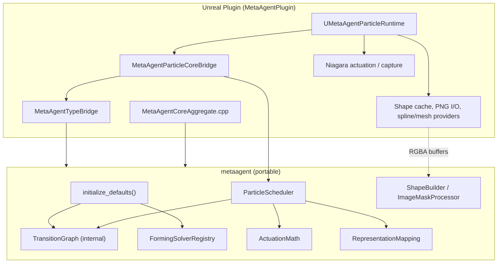
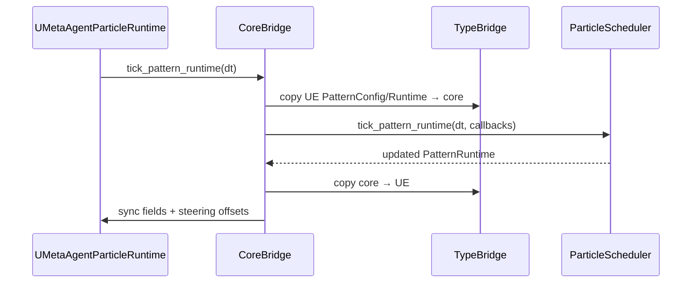

# metaagent — Architecture

Portable C++17 library that owns MetaAgent **particle pattern mechanics**: finite-state machine, forming/return motion, anticipation math, representation mapping, shape building, image mask sampling, and the per-tick scheduler. Unreal Engine integration lives in the UE plugin as a thin bridge; this library has no dependency on Unreal headers.

---

## Design goals

| Goal | How it is achieved |
|------|---------------------|
| **Portability** | Standard C++17, `metaagent::core::*` value types instead of `FVector` / `FString` |
| **Single source of truth** | FSM, forming solvers, actuation math, scheduler, shape/mask algorithms live here |
| **Testability** | CMake build + unit tests without launching the editor |
| **Engine bridge** | UE plugin converts types, supplies I/O callbacks (Niagara, PNG load, world queries) |

---

## Layer diagram



**Data flow on each pattern tick**



There is **no separate UE transition-graph module**. FSM edges are evaluated inside `ParticleScheduler` via `TransitionGraph` in the core library.

---

## Repository layout

```
metaagent/
├── include/metaagent/          # Public API (declarations)
│   ├── metaagent.hpp           # Umbrella include — start here
│   ├── export.hpp              # METAAGENT_API macro
│   ├── initialize.hpp          # initialize_defaults()
│   ├── core/                   # Portable primitives
│   └── particle/               # Pattern FSM domain
├── src/metaagent/              # Implementations (one .cpp per module)
├── tests/                      # Standalone unit tests
├── CMakeLists.txt
└── ARCHITECTURE.md             # This file
```

### Why both `include/` and `src/`?

This is the standard C++ **declaration / definition split**, not two parallel implementations.

| Location | Contains | Consumed by |
|----------|----------|-------------|
| `include/metaagent/**/*.hpp` | Types, enums, class interfaces | Any translation unit that *uses* the library |
| `src/metaagent/**/*.cpp` | Method bodies, static tables, algorithms | Linked into `libmetaagent.a` (or compiled via UE aggregate) |

**Entry point for embedders:**

```cpp
#include <metaagent/metaagent.hpp>

int main() {
    metaagent::initialize_defaults();
}
```

---

## Module map

### Core (`metaagent/core/`)

| Header | Responsibility |
|--------|----------------|
| `types.hpp` | `Vec2`, `Vec3`, `Rotator`, `String`, `Array<T>`, `ColorRGBA` |
| `math.hpp` | `clamp`, `smooth_step01`, curve sampling |
| `log_sink.hpp` | Optional injectable log callbacks |

### Particle domain (`metaagent/particle/`)

| Module | Key types / classes | Role |
|--------|---------------------|------|
| `pattern_types` | `PatternState`, `PatternConfig`, `PatternRuntime` | FSM state + runtime buffers |
| `transition_graph` | `TransitionGraph` | Internal FSM table (used by scheduler, not exposed to UE) |
| `forming_solver` | `FormingSolverRegistry` | Per-particle motion during **Forming** |
| `actuation_math` | `ActuationMath` | Anticipation offsets, blend alpha |
| `representation_types` | `RepresentationMapping` | Macro phases (Prepare/Express/Sustain/Release) |
| `shape_builder` | `ShapeBuilder` | Grid, silhouette assignment, shape frames |
| `image_mask_processor` | `image_mask::build_mask_from_rgba` | CPU silhouette sampling from RGBA |
| `scheduler` | `ParticleScheduler`, `SchedulerCallbacks` | Orchestrates tick, FSM, representation frame |

---

## Pattern FSM (core-internal)

Nine pattern states: `Idle`, `Preparing`, `Anticipating`, `Forming`, `Holding`, `Returning`, `Dissipating`, `Releasing`.

The scheduler advances states via `TransitionGraph::evaluate_transition()` on timeout, manual advance, cancel, morph, etc. UE code calls `DispatchPatternTransition()` on the runtime, which bridges to the scheduler — it does not maintain a parallel FSM table.

---

## Scheduler and callbacks

`ParticleScheduler` injects engine-specific work through `SchedulerCallbacks`:

```cpp
struct SchedulerCallbacks {
    std::function<bool()> build_pattern_targets;
    std::function<bool()> begin_pattern_start;
    std::function<void(PatternState, PatternState)> enter_pattern_state;
    std::function<float(PatternState, float)> evaluate_phase_for_state;
    // ...
};
```

The UE bridge implements these via `friend struct FMetaAgentCoreBridgeFriend` on `UMetaAgentParticleRuntime`.

---

## Build and embed

### Standalone (CMake)

```powershell
cd metaagent
cmake -S . -B build -DCMAKE_BUILD_TYPE=Release
cmake --build build
ctest --test-dir build --output-on-failure
```

### Unreal Engine

`MetaAgentCoreAggregate.cpp` `#include`s all `metaagent/src/**/*.cpp` into the module. `MetaAgentPlugin.Build.cs` adds `metaagent/include` to public include paths.

**UE facades that delegate to core (no duplicate logic):**

| UE file | Core delegate |
|---------|---------------|
| `MetaAgentParticleCoreBridge` | `ParticleScheduler` |
| `MetaAgentTypeBridge` | All struct/enum conversion |
| `MetaAgentParticleFormingSolver` | `FormingSolverRegistry` |
| `MetaAgentParticleActuation` (anticipation) | `ActuationMath` |
| `MetaAgentParticleShapeBuilder` (grid/silhouette math) | `ShapeBuilder` |
| `MetaAgentParticleImageMaskProcessor` | `image_mask::build_mask_from_rgba` |
| `MetaAgentParticlePatternTypes` (presets) | `PatternConfig::apply_preset` |

---

## What stays in the UE plugin

| Folder | Keep? | Role |
|--------|-------|------|
| `Bridge/` | **Yes** | Type conversion, scheduler bridge, core aggregate |
| `Core/` | **Yes** | `LogMetaAgent`, runtime active flag |
| `Public/` + `Private/` | **Yes** | Module, settings, subsystem, Blueprint library |
| `Gameplay/` | **Yes** | Game mode, character shells, wander AI (product layer) |
| `Systems/ParticleRuntime/` | **Partial** | Niagara I/O, UObject runtime, shape cache, spline/mesh providers |
| `Systems/GUIRuntime/` | **Yes** | HUD, runtime panels |
| `Systems/CameraRuntime/` | **Yes** | Camera hooks |
| `Systems/CharacterRuntime/` | **Yes** | Character movement glue |
| `Systems/AIRuntime/` | **Yes** | Autopilot |
| `Systems/NetworkingRuntime/` | **Yes** | HTTP / game instance networking |
| `Systems/RecordingRuntime/` | **Yes** | Movie capture |

### What could move to `metaagent` next

| Candidate | Blocker |
|-----------|---------|
| Spline/mesh shape sampling | Needs world-component queries — keep UE providers, optionally add portable sampling API fed with pre-extracted points |
| Return curve evaluation | Already sampled in TypeBridge; could push curve sampling into core-only tests |
| Orchestrator / input routing | Product UX, not core mechanics |
| GUI / camera / networking | Engine-bound by design |

---

## Extension points

1. **New forming mode** — implement in `forming_solver.cpp`, register in `initialize_defaults()`, mirror enum in TypeBridge.
2. **New shape source** — UE provider in `MetaAgentParticleShapeRegistry`; optional portable algorithm in `shape_builder.cpp`.
3. **Custom phase curves** — override `SchedulerCallbacks::evaluate_phase_for_state` (UE supplies `UCurveFloat`).

For product-level usage, see the repository root `README.md`.
