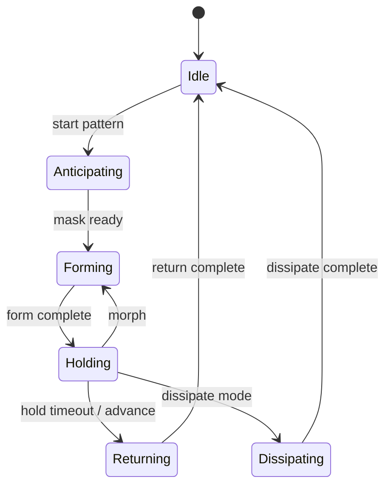

# metaagent — Architecture

Portable C++17 library for MetaAgent **particle pattern mechanics**. Unreal integration is a thin type bridge + Niagara I/O in the UE plugin.

---

## Design goals

| Goal | How |
|------|-----|
| Portability | C++17, `metaagent::core::*` value types (no `FVector` / `FString`) |
| Single source of truth | FSM, solvers, phase curves, actuation compose, scheduler, shape/mask algorithms |
| Testability | CMake + unit tests without the editor |
| Engine bridge | UE converts types and supplies I/O callbacks (Niagara, PNG, world queries) |

---

## Repository layout

```
metaagent/
├── metaagent.h                    Umbrella public API
├── metaagent.cpp                  Single TU — #includes all module .cpp files
├── include/metaagent/
│   ├── initialize.hpp             initialize_defaults()
│   ├── core/                      Vec3, math, log_sink
│   ├── media/                     PNG/JPEG decode, MediaStore, mask pipeline
│   ├── camera/                    Zoom + cinematic rig/controller
│   └── particle/                  Pattern domain
├── tests/
├── CMakeLists.txt
├── README.md
└── ARCHITECTURE.md
```

Public entry point: `#include <metaagent/metaagent.h>` (amalgamation header at repo `metaagent/metaagent.h`).

---

## Module map

### Media (`metaagent/media/`)

| Module | Role |
|--------|------|
| `decode` | PNG/JPEG via stb_image (file + memory) |
| `store` | Load/cache images by path identity |
| `pipeline` | Mask build + preview thumbnails |
| `mask_cache` | Sync mask result cache |

### Camera (`metaagent/camera/`)

| Module | Role |
|--------|------|
| `types` | Zoom/cinematic settings, focus bounds |
| `rig` | Orbital sway math (`compute_cinematic_pose`) |
| `controller` | Per-session camera state (zoom + cinematic tick) |

### Core (`metaagent/core/`)

| Header | Role |
|--------|------|
| `types.hpp` | `Vec2`, `Vec3`, `Rotator`, `String`, `Array<T>` |
| `math.hpp` | `clamp`, `smooth_step01`, `evaluate_curve01`, `lerp` |
| `log_sink.hpp` | Injectable log callbacks |

### Particle domain (`metaagent/particle/`)

| Module | Key API | Role |
|--------|---------|------|
| `pattern_types` | `PatternConfig`, `PatternRuntime` | FSM state, buffers, **form/return asset curve samples** |
| `transition_graph` | `TransitionGraph` | FSM table (scheduler-internal) |
| `scheduler` | `ParticleScheduler`, `SchedulerCallbacks` | Tick, transitions, representation frame |
| `forming_solver` | `FormingSolverRegistry` | Per-particle forming / return motion |
| `actuation_math` | `ActuationMath` | Anticipation, blend alpha, **`evaluate_phase_for_state`**, **`compose_particle_world_position`** |
| `representation_actuation` | `RepresentationActuationPolicy` | Direct / Parameters / Hybrid delivery |
| `representation_types` | `RepresentationMapping` | Macro phases |
| `shape_builder` | `ShapeBuilder` | Targets, frames, silhouette assignment |
| `image_mask_processor` | `image_mask::build_mask_from_rgba` | Mask + stratified scatter |
| `forming_types` / `return_types` | Settings structs | Mode enums and curve sample arrays |

---

## Pattern FSM

States: `Idle`, `Preparing`, `Anticipating`, `Forming`, `Holding`, `Returning`, `Dissipating`, `Releasing`.

The scheduler advances via `TransitionGraph::evaluate_transition()`. UE calls `DispatchPatternTransition()` on the runtime, which bridges to the scheduler — **no parallel FSM table in the plugin**.



---

## Phase evaluation

`ActuationMath::evaluate_phase_for_state()` is the default for forming and returning ticks:

- **Forming:** `PatternRuntime.form_curve_samples` (from UE `ActiveFormCurve`) or smoothstep
- **Returning:** mode curve from `ReturnSettings` → asset fallback (`asset_return_curve_samples`) → inverted smoothstep

UE samples `UCurveFloat` into core arrays in `SyncRuntimeToCore`; the scheduler no longer requires an `evaluate_phase_for_state` callback.

---

## Actuation composition

`ActuationMath::compose_particle_world_position()` implements the full per-particle blend path:

- Return hold lerp or return forming solver
- Anticipation motion
- Dissipate toward center
- Forming solvers + anticipation→forming carryover
- Default lerp + forming steering offsets

UE builds `ActuationComposeInput` via `MetaAgentTypeBridge::build_actuation_compose_input()` and only writes results into Niagara buffers.

---

## Representation actuation policy

`RepresentationActuationPolicy::resolve()` chooses:

| Delivery | When |
|----------|------|
| `ParametersWithTargets` | Parameters-only mode, or return release below threshold |
| `DirectWrite` | Direct mode |
| `HybridDirectWithScalars` | Hybrid: direct buffer write + scalar User params (no target UObject push) |

Hybrid resolves to Direct in editor builds and Parameters in shipping (`hybrid_use_direct_path` flag).

---

## Scheduler callbacks (UE bridge)

Engine-specific work still uses `SchedulerCallbacks`:

```cpp
struct SchedulerCallbacks {
    std::function<bool()> build_pattern_targets;
    std::function<bool()> begin_pattern_start;
    std::function<void(PatternState, PatternState)> enter_pattern_state;
    // evaluate_phase_for_state optional — default uses ActuationMath + synced curves
    // ...
};
```

Implemented in `FMetaAgentCoreBridgeFriend` (`MetaAgentTypeBridge.cpp`).

---

## UE plugin split (18 flat source files)

| Plugin file | Role |
|-------------|------|
| `MetaAgentCoreAggregate.cpp` | Embeds `metaagent/metaagent.cpp` (amalgamation) |
| `MetaAgentTypeBridge.*` | UE ↔ core conversion, scheduler bridge, compose scratch |
| `MetaAgentParticleRuntime.*` | UObject instance, Niagara tick glue |
| `MetaAgentParticleControl.*` | Orchestrator, drivers, Niagara profiles, representation apply |
| `MetaAgentParticleShapes.*` | PNG load, mask cache, shape providers → core `ShapeBuilder` |
| `MetaAgentParticleTypes.h` | USTRUCT/UENUM mirrors |
| `MetaAgentPlayerController.*` | Input, camera, GUI, recording, AI, particles UI |
| `MetaAgentGameplay.*` | Game mode, character, networking game instance |
| `MetaAgentHUD.h` | HUD panel types |
| `MetaAgentPlugin.*` | Module startup, settings, Blueprint library |

**Stays in UE by design:** Niagara RHI/GPU, orchestrator UX, HUD, view-target blending, gameplay actors, world/PNG I/O.

---

## Planned: HTTP / platform layer in core

Today `/health`, `/echo`, and `/notify` live in `MetaAgentGameplay.cpp` / `MetaAgentPlugin.cpp` on Epic’s `HTTPServer` module. Target layout:

| Phase | Location | Work |
|-------|----------|------|
| **A** | `metaagent/net/` | Platform-agnostic `HttpServer` interface, route table, JSON helpers, stub server for unit tests |
| **B** | `Source/MetaAgentPlugin/` | `FMetaAgentHttpServerBridge` — binds Epic HTTPServer, forwards bytes to core handlers |
| **C** | `metaagent/net/handlers/` | Move handler bodies (health, echo, notify) into core; UE passes world/session context via bridge callbacks |
| **D** | `metaagent/tools/` (optional) | Standalone `metaagent_server` CLI using same net module for CI / headless testing |

**Keep in UE:** TLS/cert binding if needed, GameInstance lifecycle, routing to live orchestrator / particle runtime, Blueprint-exposed notify hooks.

---

## Build

### Standalone

```powershell
cd metaagent
cmake -S . -B build -DCMAKE_BUILD_TYPE=Release
cmake --build build
ctest --test-dir build --output-on-failure
```

### Unreal

`MetaAgentCoreAggregate.cpp` includes portable sources; `MetaAgentPlugin.Build.cs` adds `metaagent/include`.

---

## Extension points

1. **New forming mode** — add solver in `forming_solver.cpp`, register in `initialize_defaults()`, mirror enum in TypeBridge.
2. **New shape source** — UE provider in shape registry (world I/O); portable assignment in `shape_builder.cpp`.
3. **Custom phase curves** — sample curves into `PatternRuntime.form_curve_samples` / `asset_return_curve_samples` (or optional scheduler callback override).

Product usage and keyboard controls: repository root [`README.md`](../README.md).
