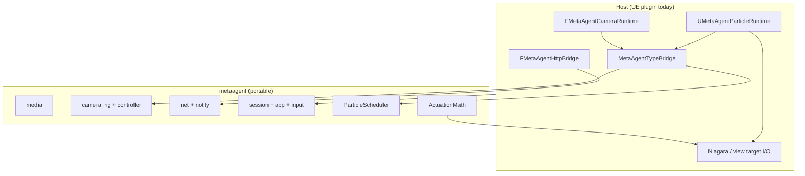

# metaagent

Portable C++17 core for MetaAgent: **particle pattern mechanics**, **camera rig math**, **media/mask pipeline**, **inbound HTTP handlers**, **runtime session + command validation**, and **input policy**. No Unreal headers.

Full design notes: [`ARCHITECTURE.md`](./ARCHITECTURE.md).

## Layout

```
metaagent/
  metaagent.h                 Public umbrella API (single include)
  metaagent.cpp               Amalgamated implementation
  include/metaagent/            Headers + module .cpp implementations
  tests/                      Standalone unit tests (CMake)
  CMakeLists.txt
  ARCHITECTURE.md
```

Embed in another engine: add `metaagent/include` and compile `metaagent.cpp` once (the UE plugin does this via `MetaAgentCoreAggregate.cpp`).

## Layer diagram



## Portable modules (summary)

| Namespace | Responsibility |
|-----------|----------------|
| `metaagent::particle` | FSM, scheduler, forming/return solvers, actuation, shape/mask |
| `metaagent::camera` | Zoom, cinematic orbit pose, sway, `CameraController` |
| `metaagent::media` | PNG/JPEG decode, mask pipeline, thumbnails |
| `metaagent::net` | Router + `/health` `/echo` `/notify` handlers |
| `metaagent::session` | `RuntimeSession`, feature flags, status text |
| `metaagent::app` | Command parse/validate, GUI action validation |
| `metaagent::input` | GUI-open vs observation-mode input policy |

## Camera (portable vs host)

**In core:** orbit math, sway, oscillation, wheel zoom on orbit radius, enable/disable cinematic state.

**In UE host:** resolving focus from live particles, blending view targets, startup observation lock, applying poses to `APlayerCameraManager`.

To add a new cinematic **style** (movement profile):

1. Extend `metaagent::camera::CinematicStyle` and `compute_cinematic_pose()` in `camera/rig.cpp`.
2. Mirror the enum on `FMetaAgentCinematicCameraState` and sync via `MetaAgentTypeBridge`.
3. Tune defaults on `AMetaAgentPlayerController` (`CinematicCamera` UPROPERTY block).

To change **configs** without new styles, edit `CinematicSettings` fields (core) or `FMetaAgentCinematicCameraState` (UE) — they sync each tick through TypeBridge.

## HTTP

| Direction | Location |
|-----------|----------|
| **Inbound** (local server) | Handler logic in `metaagent/net/`; Epic bind in `Source/MetaAgentPlugin/Host/MetaAgentHttpBridge.cpp` |
| **Outbound** (platform COMMS) | Still in UE (`UMetaAgentGameInstance::SendEventToPlatform`) — not in core yet |

## Standalone build

```powershell
cd metaagent
cmake -S . -B build -DCMAKE_BUILD_TYPE=Release
cmake --build build
ctest --test-dir build --output-on-failure
```

## Unreal integration

The UE plugin embeds this library via `Source/MetaAgentPlugin/MetaAgentCoreAggregate.cpp`.

Host adapters (thin):

- `Host/MetaAgentHttpBridge` — HTTPServer → core router
- `Host/MetaAgentHostSession` — live modular runtime flags → `RuntimeSession`
- `Host/MetaAgentInputBridge` — wraps `validate_command` / `validate_gui_action`

Particle tick path: `UMetaAgentParticleRuntime` → `MetaAgentParticleCoreBridge` → `ParticleScheduler`.

Camera tick path: `FMetaAgentCameraRuntime` → `CameraController::tick_cinematic()` → apply pose to viewport.

## Embed elsewhere

```cpp
#include <metaagent/metaagent.h>

int main() {
    metaagent::initialize_defaults();
    metaagent::camera::CameraController& cam = metaagent::camera::default_controller();
    // ...
}
```
