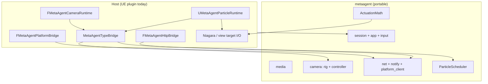

# metaagent

Portable C++17 core for MetaAgent: **particle pattern mechanics**, **camera rig math**, **media/mask pipeline**, **HTTP (inbound handlers + outbound platform client)**, **runtime session + command validation**, and **input policy**. No Unreal headers.

Full design notes: [`ARCHITECTURE.md`](./ARCHITECTURE.md).

## Layout

```
metaagent/
  metaagent.h                 Public umbrella API (single include)
  metaagent.cpp               Amalgamated implementation
  include/metaagent/          Headers + module .cpp implementations
  tests/                      Standalone unit tests (CMake)
  CMakeLists.txt
  ARCHITECTURE.md
```

Embed in another engine: add `metaagent/include` and compile `metaagent.cpp` once (the UE plugin does this via `MetaAgentCoreAggregate.cpp`).

## Layer diagram



## Portable modules (summary)

| Namespace | Responsibility |
|-----------|----------------|
| `metaagent::particle` | FSM, scheduler, forming/return solvers, actuation, shape/mask, **effect catalog** |
| `metaagent::camera` | Zoom, cinematic orbit pose, sway, **`SlowOrbit` style**, `CameraController` |
| `metaagent::media` | PNG/JPEG decode, mask pipeline, thumbnails |
| `metaagent::net` | Router, inbound handlers, **`platform_client` (outbound)** |
| `metaagent::session` | `RuntimeSession`, feature flags, status text |
| `metaagent::app` | Command parse/validate, **GUI panel catalog**, GUI action validation |
| `metaagent::runtime` | **Host service callbacks** (recording, AI snapshots) |
| `metaagent::input` | GUI-open vs observation-mode input policy |

## HTTP

| Direction | Core | UE host |
|-----------|------|---------|
| **Inbound** (local server) | `net/handlers`, `net/router` | `FMetaAgentHttpBridge` |
| **Outbound** (platform COMMS) | `net/platform_client` | `FMetaAgentPlatformBridge` |

## Standalone build

```powershell
cd metaagent
cmake -S . -B build -DCMAKE_BUILD_TYPE=Release
cmake --build build
ctest --test-dir build --output-on-failure
```

### Standalone server (no Unreal)

```powershell
cmake --build build --target metaagent_server
./build/metaagent_server.exe --port 8080
```

Exercises the same inbound router/handlers as `FMetaAgentHttpBridge`, useful for CI and headless validation.

## Unreal integration

The UE plugin embeds this library via `Source/MetaAgentPlugin/MetaAgentCoreAggregate.cpp`.

Host adapters (thin):

- `Host/MetaAgentHttpBridge` — inbound HTTPServer → core router
- `Host/MetaAgentPlatformBridge` — outbound platform POST
- `Host/MetaAgentHostSession` — session snapshot → `RuntimeSession`
- `Host/MetaAgentInputBridge` — command / GUI validation wrapper

Tick / dispatch paths:

- Particles: `UMetaAgentParticleRuntime` → `ParticleScheduler`
- Camera: `FMetaAgentCameraRuntime` → `CameraController::tick_cinematic()`
- Platform COMMS: `SendEventToPlatform` → `platform_client` → `FMetaAgentPlatformBridge`

## Embed elsewhere

```cpp
#include <metaagent/metaagent.h>

int main() {
    metaagent::initialize_defaults();
    metaagent::net::PlatformEndpointConfig config;
    config.base_url = "http://127.0.0.1:8000";
    config.event_endpoint = "/api/unreal/event";
    // build_platform_outbound_request(...) — no UE required
    return 0;
}
```
