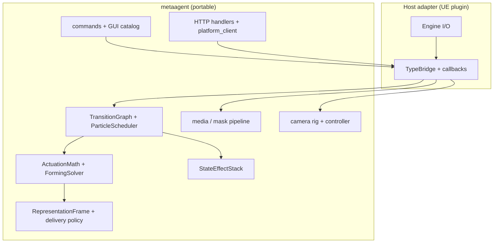

# metaagent

Portable C++17 core for MetaAgent: **particle pattern mechanics**, **camera rig math**, **media/mask pipeline**, **HTTP (inbound + outbound)**, **session + command validation**, and **input policy**. No Unreal headers.

Full design notes: [`ARCHITECTURE.md`](./ARCHITECTURE.md).

## What this library is

`metaagent` is the **domain layer** for a multimodal agent runtime. Hosts (Unreal today, others later) supply:

- World I/O (Niagara buffers, view target, filesystem, async HTTP transport)
- Type conversion (`FVector` ↔ `metaagent::core::Vec3`)
- Asset binding (textures, pattern assets, Niagara profiles)

Everything that can be expressed as **state + math + validation + JSON** lives here so it can be unit-tested without an editor.



## Layout

```
metaagent/
  metaagent.h                 Public umbrella API (single include)
  metaagent.cpp               Amalgamated implementation
  include/metaagent/          Headers + module .cpp implementations
  tests/                      Standalone unit tests (CMake)
  tools/                      metaagent_server CLI
  CMakeLists.txt
  ARCHITECTURE.md
```

Embed elsewhere: add `metaagent/include`, compile `metaagent.cpp` once (the UE plugin uses `MetaAgentCoreAggregate.cpp`).

## Portable modules

| Namespace | Responsibility |
|-----------|----------------|
| `metaagent::particle` | FSM, scheduler, forming/return solvers, actuation compose, shape/mask, state effects, effect catalog |
| `metaagent::camera` | Zoom, cinematic orbit pose, sway, `SlowOrbit`, `CameraController` |
| `metaagent::media` | PNG/JPEG decode, mask pipeline, thumbnails |
| `metaagent::net` | Router, inbound handlers, `platform_client` (outbound) |
| `metaagent::session` | `RuntimeSession`, feature flags, status text |
| `metaagent::app` | Command parse/validate, GUI panel catalog, GUI action validation |
| `metaagent::runtime` | Host service callbacks (recording, AI snapshots) |
| `metaagent::input` | GUI-open vs observation-mode input policy |

## Host integration contract (particles)

The scheduler is **callback-driven**. The host implements `SchedulerCallbacks`:

| Callback | Host responsibility |
|----------|---------------------|
| `build_pattern_targets` | Shape providers, async mask cache, sync runtime → core |
| `begin_pattern_start` | Capture rest/display pose, set active config/tags |
| `enter_pattern_state` | Sync core ↔ runtime, optional side effects |
| `complete_pattern_run` | Reset runtime, re-seed idle baseline |

**Known gap (teleport after Idle):** core composes positions from **rest baseline**; the host applies **state-effect offsets** (ambient breathing) after compose. Continuity logic is split across `scheduler.cpp` and UE `MetaAgentParticleRuntime.cpp` (`LastAppliedWorldPositions`, authoritative particle count). See [Visual continuity](./ARCHITECTURE.md#visual-continuity-and-the-idle-transition-teleport) in ARCHITECTURE.md — the next library milestone is a single core API: **freeze displayed pose on transition**.

## HTTP

| Direction | Core | UE host |
|-----------|------|---------|
| **Inbound** | `net/handlers`, `net/router` | `FMetaAgentHttpBridge` |
| **Outbound** | `net/platform_client` | `FMetaAgentPlatformBridge` |

## Standalone build

```powershell
cd metaagent
cmake -S . -B build -DCMAKE_BUILD_TYPE=Release
cmake --build build
ctest --test-dir build --output-on-failure
```

### Standalone server

```powershell
cmake --build build --target metaagent_server
./build/metaagent_server.exe --port 8080
```

## Unreal integration

The UE plugin embeds this library via `Source/MetaAgentPlugin/MetaAgentCoreAggregate.cpp`.

| Adapter | Role |
|---------|------|
| `MetaAgentTypeBridge` | UE ↔ core conversion, scheduler bridge, camera sync |
| `UMetaAgentParticleRuntime` | Tick glue, Niagara actuation, displayed-pose cache |
| `UMetaAgentParticleControl` | Orchestrator, representation drivers |
| `Host/MetaAgentHttpBridge` | Inbound HTTPServer |
| `Host/MetaAgentPlatformBridge` | Outbound platform POST |
| `Host/MetaAgentHostSession` | Session snapshot for validation |
| `Host/MetaAgentInputBridge` | Command / GUI validation |

Tick paths:

- Particles: `UMetaAgentParticleRuntime` → `ParticleScheduler`
- Camera: `FMetaAgentCameraRuntime` → `CameraController::tick_cinematic()`
- Platform: `SendEventToPlatform` → `platform_client` → `FMetaAgentPlatformBridge`

## Embed elsewhere

```cpp
#include <metaagent/metaagent.h>

int main() {
    metaagent::initialize_defaults();
    metaagent::net::PlatformEndpointConfig config;
    config.base_url = "http://127.0.0.1:8000";
    config.event_endpoint = "/api/unreal/event";
    // build_platform_outbound_request(...) — no UE required
    return 0;
}
```

## Recommended next steps (library)

1. **Visual continuity in core** — `DisplayedPose`, `freeze_pose_for_transition()`, host `read_displayed_positions` callback; unit test Idle→Preparing→Forming with zero delta.
2. **Authoritative particle count in `PatternRuntime`** — one count for mask builds, baselines, and capture rejection (remove duplicated UE-only logic).
3. **Extend `runtime/host_interfaces`** — `ParticleHostCallbacks` (capture, apply, displayed read) alongside recording/AI.
4. **Continuity tests** — `visual_continuity_test.cpp` for every FSM edge that changes macro phase.
5. **Wire recording/AI** — implement `HostServiceCallbacks` in UE; expose panel rows when ready.

Details: [`ARCHITECTURE.md`](./ARCHITECTURE.md#roadmap).
