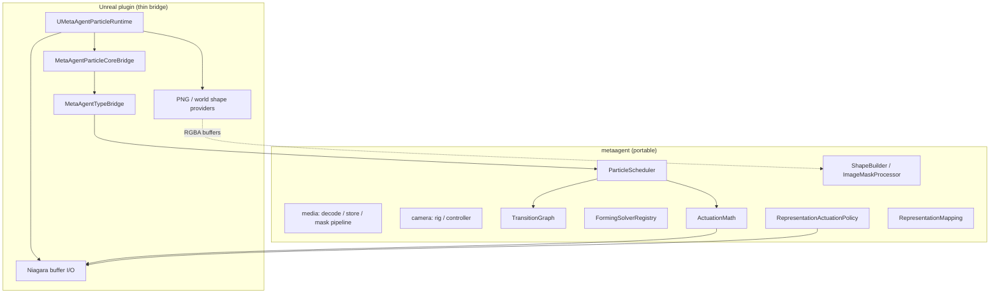
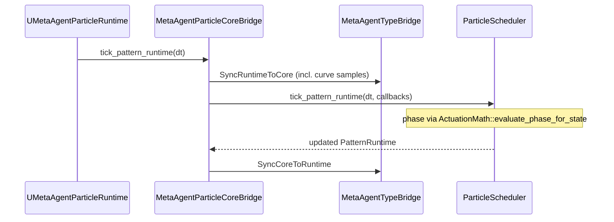
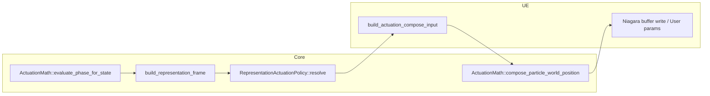

# metaagent

Portable C++17 core for MetaAgent **particle pattern mechanics**: FSM, scheduler, forming/return solvers, phase curves, per-particle actuation composition, representation actuation policy, shape scatter, and image-mask sampling. No Unreal headers.

Full design notes: [`ARCHITECTURE.md`](./ARCHITECTURE.md).

## Layout

```
metaagent/
  metaagent.h                 Public umbrella API (single include)
  metaagent.cpp               Amalgamated implementation (includes all .cpp under include/metaagent/)
  include/metaagent/          Headers + module .cpp implementations
  tests/                      Standalone unit tests (CMake)
  CMakeLists.txt
  ARCHITECTURE.md
```

Embed in another engine: add `metaagent/include` and `metaagent/` to include paths, compile `metaagent.cpp` once (the UE plugin does this via `MetaAgentCoreAggregate.cpp`).

## Layer diagram



## Tick flow (scheduler bridge)



## Actuation pipeline (core vs UE)



| Core module | Responsibility |
|-------------|----------------|
| `pattern_types` | `PatternState`, `PatternConfig`, `PatternRuntime` (+ asset curve samples) |
| `transition_graph` | FSM edges (internal to scheduler) |
| `scheduler` | Tick, transitions, representation frame, status text |
| `forming_solver` | Forming / return motion solvers (DirectLerp, ArcLift, SpiralIn, …) |
| `actuation_math` | Anticipation, blend alpha, **phase evaluation**, **position composition** |
| `representation_actuation` | Hybrid / Direct / Parameters delivery policy |
| `representation_types` | Macro phases (Prepare → Express → Sustain → Release) |
| `shape_builder` | Grid, polyline, silhouette assignment, shape frames |
| `image_mask_processor` | CPU mask from RGBA + stratified scatter |

## Standalone build

```powershell
cd metaagent
cmake -S . -B build -DCMAKE_BUILD_TYPE=Release
cmake --build build
ctest --test-dir build --output-on-failure
```

Tests: `transition_graph_test`, `forming_types_test`, `shape_builder_polyline_test`, `actuation_composer_test`.

## Unreal integration

The UE plugin embeds this library via `Source/MetaAgentPlugin/MetaAgentCoreAggregate.cpp` and exposes headers through `MetaAgentPlugin.Build.cs`.

- FSM tick, transitions, representation frame, and status strings → `metaagent::particle::ParticleScheduler` (`MetaAgentParticleCoreBridge` in `MetaAgentTypeBridge.cpp`).
- UE ↔ core conversion, curve sampling, actuation compose scratch → `MetaAgentTypeBridge`.
- Niagara GPU/CPU buffer I/O only → `MetaAgentParticleRuntime.cpp` / `MetaAgentParticleControl.cpp`.

## Embed elsewhere

Add `metaagent/include` to your include path and compile via the amalgamation entry point, or link the CMake static library.

```cpp
#include <metaagent/metaagent.h>

int main() {
    metaagent::initialize_defaults();
    // ...
}
```
